# afd_26100.8246_post.sys

(Auto-seeded; replace this description.) Catalogued in 1 engagement(s).

## At a glance

- **Binary**: `afd_26100.8246_post.sys`
- **Binary Kind**: sys

_No attack-surface map: no sources or sinks catalogued._

## Trust boundary & process model (Layer 2)

Privilege ladder around this binary, with IPC peers and impersonation status.

- **Loaded by**: `—`
- **Principal**: kernel
- **Start trigger**: —
- **Impersonation seen**: False
- **PPL protected**: False

```mermaid
flowchart TB
    subgraph ZStandard_user_attack["Standard user &#40;attacker&#41;"]
        Nany_standard_user_proces((&#40;any standard-user process&#41;)):::attacker
    end
    subgraph Zkernel["kernel"]
        Nafd_26100_8246_post_sys["**afd_26100.8246_post.sys**<br/>(this binary)"]:::self
    end
    classDef self fill:#222,stroke:#000,color:#fff
    classDef peer fill:#eef,stroke:#039
    classDef attacker fill:#fdd,stroke:#c00,color:#600
```

## Class coverage matrix (comprehensive)

Every taxonomy class relevant to this binary's platform + kind. **Goal: zero `unchecked` rows.** Unchecked rows show the inline detection checklist; walk through, then update `class_coverage[]` in the YAML.

_7 relevant classes; 0 present · 0 defense observed · 0 not present · 7 unchecked_

### Group I

| Class | Status | Rationale / refs |
|-------|--------|-------------------|
| `I-006` ALPC port (kernel) | ⏳ unchecked | _walk the detection checklist below_ |

Detection checklist for <code>I-006</code> — ALPC port (kernel)

**Canonical defense:** Implement an ALPC connection callback that validates caller via AlpcGetMessageAttribute + PsLookupProcessByProcessId checks.

**Common bypasses:**
- Connection callback absent / validates wrong attribute

**Detection checklist:**
- [ ] Q1: does the kernel-mode binary call IoCreateAlpcPort / NtAlpcCreatePort?
- [ ] Q2: is a connection callback registered? Does it actually validate caller?
- [ ] Q3: do the message handlers perform privileged operations?
- [ ] Q4: can user-mode reach the port (NtAlpcConnectPort)?
- [ ] Q5: is the port's security descriptor permissive?
- [ ] 5/5 → present.

### Group K

| Class | Status | Rationale / refs |
|-------|--------|-------------------|
| `K-001` IOCTL input buffer (IRP_MJ_DEVICE_CONTROL) | ⏳ unchecked | _walk the detection checklist below_ |
| `K-002` FSCTL / minifilter port operation | ⏳ unchecked | _walk the detection checklist below_ |
| `K-003` WMI provider input | ⏳ unchecked | _walk the detection checklist below_ |
| `K-004` Object/process/image-load/registry callback | ⏳ unchecked | _walk the detection checklist below_ |
| `K-005` Non-IOCTL IRP (read/write/create) | ⏳ unchecked | _walk the detection checklist below_ |
| `K-006` Kernel-resident user-mapped buffer (multi-fetch / Cc-mapped) | ⏳ unchecked | _walk the detection checklist below_ |

Detection checklist for <code>K-001</code> — IOCTL input buffer (IRP_MJ_DEVICE_CONTROL)

**Canonical defense:** IoCreateDeviceSecure with admin-only SDDL; SeAccessCheck per IOCTL; METHOD_BUFFERED default; ProbeForRead/ProbeForWrite for METHOD_NEITHER inside __try/__except; integer-overflow checks on user-supplied lengths.

**Common bypasses:**
- Length-field integer-overflow / underflow
- TOCTOU on user pointer swap
- Double-fetch (K-006 subclass)
- MmMapLockedPages with user unmap mid-execution

**Detection checklist:**
- [ ] Q1: does DriverEntry set DriverObject->MajorFunction[IRP_MJ_DEVICE_CONTROL]?
- [ ] Q2: are any IOCTLs METHOD_NEITHER without ProbeForRead/Write?
- [ ] Q3: is the device object's SDDL permissive (not admin-only)?
- [ ] Q4: are length fields used as buffer sizes without overflow checks?
- [ ] Q5: is the device reachable from low-priv (accesschk -e \Device\<name>)?
- [ ] 5/5 → present.

**Tools:** `WinObj.exe`, `accesschk -e \Device\<name>`, `scripts/multifetch_scan.py for K-006 subclass`

Detection checklist for <code>K-002</code> — FSCTL / minifilter port operation

**Canonical defense:** SDDL on the port; per-message authentication; bounds-check input/output sizes; FltGetFilterFromName ACL check.

**Detection checklist:**
- [ ] Q1: does the binary call FltCreateCommunicationPort?
- [ ] Q2: is the port SDDL permissive?
- [ ] Q3: do the per-message handlers lack bounds checks?
- [ ] Q4: are user-mode FilterSendMessage callers unauthenticated?
- [ ] Q5: do messages drive privileged kernel operations?
- [ ] 5/5 → present.

Detection checklist for <code>K-003</code> — WMI provider input

**Canonical defense:** Validate every WMI method input; refuse callers without admin token.

**Detection checklist:**
- [ ] Q1: does the binary call IoWMIRegistrationControl?
- [ ] Q2: does it expose user-callable WMI methods (vs read-only data)?
- [ ] Q3: is method-level auth absent?
- [ ] Q4: do the methods drive privileged operations?
- [ ] Q5: is the GUID reachable from low-priv?
- [ ] 5/5 → present.

Detection checklist for <code>K-004</code> — Object/process/image-load/registry callback

**Canonical defense:** Callbacks should be defensive (validate, return STATUS_ACCESS_DENIED on suspect ops); never operate on user data without validation.

**Detection checklist:**
- [ ] Q1: does the binary register ObRegisterCallbacks / PsSetCreateProcessNotifyRoutine / CmRegisterCallbackEx?
- [ ] Q2: does the callback parse data from the triggering operation (e.g., reg key path, process command line)?
- [ ] Q3: is parsing missing bounds checks?
- [ ] Q4: can the callback be triggered by low-priv?
- [ ] Q5: does the callback perform mutation on kernel structures?
- [ ] 5/5 → present.

Detection checklist for <code>K-005</code> — Non-IOCTL IRP (read/write/create)

**Canonical defense:** Same as K-001 for the relevant IRP_MJ_*

**Detection checklist:**
- [ ] Q1: does DriverEntry set MajorFunction[IRP_MJ_READ/WRITE/CREATE]?
- [ ] Q2: do these handlers process user data?
- [ ] Q3: are bounds checks absent?
- [ ] Q4: is the device's SDDL permissive?
- [ ] Q5: is the IRP user-reachable via ReadFile/WriteFile/CreateFile on the device?
- [ ] 5/5 → present.

Detection checklist for <code>K-006</code> — Kernel-resident user-mapped buffer (multi-fetch / Cc-mapped)

**Canonical defense:** Kernel-pool snapshot before validate-and-use: copy user buffer to kernel-allocated buffer first, then validate-and-operate on the kernel copy.

**Common bypasses:**
- Vendor adds snapshot for METHOD_BUFFERED but missed METHOD_NEITHER paths
- Snapshot for one syscall but not the IOCTL that reaches the same code

**Detection checklist:**
- [ ] Q1: does the kernel binary call MmMapLockedPages / MmGetSystemAddressForMdlSafe / CcMapData with user-influenced data?
- [ ] Q2: is a single field accessed multiple times within one handler (multi-fetch pattern)?
- [ ] Q3: is the snapshot-into-kernel-pool defense absent?
- [ ] Q4: do the multi-read paths feed allocation size or pointer arithmetic?
- [ ] Q5: does scripts/multifetch_scan.py flag any candidates with confidence ≥ 2?
- [ ] 5/5 → present.

**Tools:** `scripts/multifetch_scan.py`

## Versions catalogued

| Version | First seen | Engagement | SHA256 | Notes |
|---------|------------|------------|--------|-------|
| 10.0.26100.8115 (PRE) and 10.0.26100.8246 (POST) | 2026-04-28 | afd-sys-2026-04-28 | — | Auto-seeded from afd-sys-2026-04-28/scope.json (target: Windows Ancillary Function Driver for WinSock (afd.sys)) |

## Sources (0)

_No sources catalogued yet._

## Sinks (0)

_No sinks catalogued yet._

## Chains (0)

_No chains catalogued yet._

---
_Auto-generated by `scripts/catalog_render.py` at 2026-05-09 15:29 UTC. Edit `catalog/binaries/afd_26100_8246_post_sys.yml` then re-run the renderer._
