# Backblaze Online Backup (Windows)

**Vendor**: Backblaze

Consumer cloud-backup client for Windows. Multi-process: a transmit daemon (bztransmit), a restore client (bzrestore), and a server-side helper (bzserv) that brokers operations. Engagement uncovered an NTFS-hardlink LPE (closed Duplicate by Bugcrowd) and an unsigned-update execution chain.

## Versions catalogued

| Version | First seen | Engagement |
|---------|------------|------------|
| 10.x | 2026-04-08 | `backblaze-2026-04-08` |

## Topology (Layer 4)

Process and IPC topology of the product. Binaries clustered by trust zone; edges are observed IPC connections; dotted edges from the attacker zone are speculative injection paths.

```mermaid
flowchart TB
    subgraph ZSYSTEM["SYSTEM"]
        Nbzserv_broker["bzserv &#40;broker&#41;"]:::sysz
    end
    subgraph ZAdmin_or_user["Admin_or_user"]
        Nbztransmit["bztransmit"]:::admz
        Nbzrestore["bzrestore"]:::admz
    end
    subgraph ZStandard_user_attacker["Standard_user_attacker"]
        Nany_standard_user_process["&#40;any standard-user process&#41;"]:::atkz
    end
    Nbztransmit -. local IPC .-> Nbzserv_broker
    Nbzrestore -. local IPC .-> Nbzserv_broker
    classDef sysz fill:#fdd,stroke:#900
    classDef admz fill:#fed,stroke:#a60
    classDef usrz fill:#dfd,stroke:#080
    classDef atkz fill:#222,stroke:#000,color:#fff
    classDef neut fill:#eee,stroke:#666
    classDef ext fill:#ffd,stroke:#aa0
```

## Source-class coverage across binaries

Heatmap: which v2 source classes are catalogued per binary. Counts are the number of distinct sources tagged with that class.

| Binary | F-003 | N-003 | UP-001 |
|---|---|---|---|
| `bztransmit` | · | · | · |
| `bzrestore` | · | 1 | · |
| `bzserv` | 1 | · | 1 |
| `install_backblaze.exe` | · | · | · |

## Defense distribution across the product

Defenses observed by component. `GAP:` lines flag known weaknesses still open.

### `bzserv`

- elevated broker for backup operations; runs SYSTEM
- GAP: hardlink substitution on log/state file paths (F-003) — submitted but Duplicate

### `auto_updater`

- fetches update binary from vendor URL
- GAP: signature verification absent before exec — UP-001 confirmed (finding 002)
- GAP: malicious-server / MITM model — N-003 layered with UP-001

## Vulnerabilities surfaced

Cross-binary findings catalog. Status badges: ✅ submitted_paid · 🟢 submitted · ⏳ in_progress · ⚠ submitted_dropped · ⏸ not_submitted.

| Binary | Finding | Classes | Severity | Status | Submission |
|--------|---------|---------|----------|--------|------------|
| `bzserv` | [`backblaze-2026-04-08/findings/001-hardlink-lpe.md`](../../engagements/backblaze-2026-04-08/findings/001-hardlink-lpe.md) | F-003 | TBD | ⚠ submitted_dropped | bugcrowd:Backblaze-v10 (Duplicate) |
| `bztransmit` | [`backblaze-2026-04-08/findings/002-unsigned-update-execution-lpe.md`](../../engagements/backblaze-2026-04-08/findings/002-unsigned-update-execution-lpe.md) | UP-001, N-003 | TBD | ⏸ not_submitted | — |
| `bzrestore` | [`backblaze-2026-04-08/findings/003-restore-malicious-server.md`](../../engagements/backblaze-2026-04-08/findings/003-restore-malicious-server.md) | N-003, N-004 | TBD | ⏸ not_submitted | — |
| `bzserv` | [`backblaze-2026-04-08/findings/004-related-finding.md`](../../engagements/backblaze-2026-04-08/findings/004-related-finding.md) | F-003 | TBD | ⏸ not_submitted | — |

## Open angles flagged for vendor / future investigation

- auto-updater HTTPS cert pinning status not fully audited
- restore protocol payload-level fuzzing not performed
- bzserv broker IPC ACL not enumerated for I-002 surface

## Binaries in this product

- [`bztransmit`](../bztransmit.md) — unknown, 0 sources, 0 chains
- [`bzrestore`](../bzrestore.md) — unknown, 1 sources, 1 chains
- [`bzserv`](../bzserv.md) — unknown, 2 sources, 2 chains
- [`install_backblaze.exe`](../install_backblaze_exe.md) — installer-elevated, 0 sources, 0 chains

---
_Auto-generated by `scripts/catalog_product_render.py` at 2026-05-09 15:32 UTC._
