# ISC BIND9 DNS Server

**Vendor**: ISC

Authoritative + recursive DNS server. Engagement bind9-2026-04-06: 11 parser-audit findings against various RR types and the HTTP/2 DoH endpoint. Most candidates didn't reach confirmable PoC at server-RCE level — pattern is endemic to DNS-server audits (many candidates, few that ship).

## Versions catalogued

| Version | First seen | Engagement |
|---------|------------|------------|
| 9.x current | 2026-04-06 | `bind9-2026-04-06` |

## Topology (Layer 4)

Process and IPC topology of the product. Binaries clustered by trust zone; edges are observed IPC connections; dotted edges from the attacker zone are speculative injection paths.

```mermaid
flowchart TB
    subgraph ZSYSTEM_or_root["SYSTEM_or_root"]
        Nnamed["named"]:::sysz
    end
    subgraph ZNetwork_attacker["Network_attacker"]
        Nanyone_who_can_spoof_DNS_respons["&#40;anyone who can spoof DNS responses or send queries&#41;"]:::atkz
    end
    classDef sysz fill:#fdd,stroke:#900
    classDef admz fill:#fed,stroke:#a60
    classDef usrz fill:#dfd,stroke:#080
    classDef atkz fill:#222,stroke:#000,color:#fff
    classDef neut fill:#eee,stroke:#666
    classDef ext fill:#ffd,stroke:#aa0
```

## Defense distribution across the product

Defenses observed by component. `GAP:` lines flag known weaknesses still open.

### `dns_parser`

- extensive bounds checking on RR parsing
- GAP CANDIDATES (none confirmed to ship): heap overflow rdata, TSIG/TKEY parsing, QNAME minimization, glue parsing, DNS64 mapping, NSEC3 chain, SVCB, HTTP/2 DoH null deref

### `auth_recursion`

- ACL-based query control; recursion-limit protection
- Less audited: per-finding details

## Vulnerabilities surfaced

Cross-binary findings catalog. Status badges: ✅ submitted_paid · 🟢 submitted · ⏳ in_progress · ⚠ submitted_dropped · ⏸ not_submitted.

| Binary | Finding | Classes | Severity | Status | Submission |
|--------|---------|---------|----------|--------|------------|
| `named (the BIND9 daemon)` | [`bind9-2026-04-06/findings/001-rr-parser-audit.md`](../../engagements/bind9-2026-04-06/findings/001-rr-parser-audit.md) | N-001 | TBD | ⏸ not_submitted | — |
| `named (the BIND9 daemon)` | [`bind9-2026-04-06/findings/002-heap-overflow-rdata-audit.md`](../../engagements/bind9-2026-04-06/findings/002-heap-overflow-rdata-audit.md) | N-001 | TBD | ⏸ not_submitted | — |
| `named (the BIND9 daemon)` | [`bind9-2026-04-06/findings/003-tsig-parser-audit.md`](../../engagements/bind9-2026-04-06/findings/003-tsig-parser-audit.md) | N-001 | TBD | ⏸ not_submitted | — |
| `named (the BIND9 daemon)` | [`bind9-2026-04-06/findings/004-tkey-parser-audit.md`](../../engagements/bind9-2026-04-06/findings/004-tkey-parser-audit.md) | N-001 | TBD | ⏸ not_submitted | — |
| `named (the BIND9 daemon)` | [`bind9-2026-04-06/findings/008-http2-null-deref-empty-sstreams.md`](../../engagements/bind9-2026-04-06/findings/008-http2-null-deref-empty-sstreams.md) | N-002, N-001 | TBD | ⏸ not_submitted | — |

## Open angles flagged for vendor / future investigation

- fuzz-driven follow-up on the 11 parser candidates not yet performed
- DNSSEC validation chains — KeyTrap class variants worth re-checking
- Async I/O concurrency bugs — not audited

## Binaries in this product

- `named (the BIND9 daemon)` _(no catalog/binaries/ entry yet)_

---
_Auto-generated by `scripts/catalog_product_render.py` at 2026-05-09 15:32 UTC._
