# Bitdefender Total Security

**Vendor**: Bitdefender

Consumer endpoint security suite. Multi-process architecture: SYSTEM-context service host (bdservicehost.exe) loading multiple service DLLs (bdappsrv, bdappservice, etc.); kernel drivers (bdprivmon, bddci4, trufos) for self-protection and AV operations; Admin / user-context UI processes (bdagent, seccenter, bduserhost). IPC backbone is msgbus (named pipe `local\msgbus\bdappsrv`) with application-layer auth rules (same_sign, trusted_client_process, trusted_client_path, trusted_parent_process, admin_client, admin_write_client_folder).

## Versions catalogued

| Version | First seen | Engagement |
|---------|------------|------------|
| 27 | 2026-04-11 | `bitdefender-total-security-2026-04-11` |
| 27.1 | 2026-05-02 | `bitdefender-2026-05-02` |

## Topology (Layer 4)

Process and IPC topology of the product. Binaries clustered by trust zone; edges are observed IPC connections; dotted edges from the attacker zone are speculative injection paths.

```mermaid
flowchart TB
    subgraph ZSYSTEM["SYSTEM"]
        Nbdservicehost_exe["bdservicehost.exe"]:::sysz
        Nbdappsrv_in_bdservicehost["bdappsrv &#40;in bdservicehost&#41;"]:::sysz
        Nbdappservice_dll_loaded_by_bdapp["bdappservice.dll &#40;loaded by bdappsrv&#41;"]:::sysz
        Nsafeelevatedrun_dll_loaded_by_bd["safeelevatedrun.dll &#40;loaded by bdappsrv&#41;"]:::sysz
        Nwatchdog_exe["watchdog.exe"]:::sysz
        Nproductagentservice_exe["productagentservice.exe"]:::sysz
        Nbdprivmon_sys["bdprivmon.sys"]:::sysz
        Nbddci4_sys["bddci4.sys"]:::sysz
        Ntrufos_sys["trufos.sys"]:::sysz
    end
    subgraph ZAdmin_no_PPL["Admin_no_PPL"]
        Nbdagent_exe["bdagent.exe"]:::admz
    end
    subgraph ZLoggedInUser["LoggedInUser"]
        Nseccenter_exe["seccenter.exe"]:::usrz
        Nbduserhost_exe["bduserhost.exe"]:::usrz
    end
    subgraph ZStandard_user_attacker["Standard_user_attacker"]
        Nany_standard_user_process["&#40;any standard-user process&#41;"]:::atkz
    end
    Nbdagent_exe -. msgbus pipe local\msgbus\bdappsrv .-> Nbdappsrv_in_bdservicehost
    Nseccenter_exe -. msgbus pipe local\msgbus\bdappsrv .-> Nbdappsrv_in_bdservicehost
    Nbduserhost_exe -. msgbus pipe local\msgbus\bdappsrv .-> Nbdappsrv_in_bdservicehost
    Nbdappsrv_in_bdservicehost -. in-process call .-> Nbdappservice_dll_loaded_by_bdapp
    Nbdappsrv_in_bdservicehost -. in-process call .-> Nsafeelevatedrun_dll_loaded_by_bd
    XCreateProcessAsUserW([CreateProcessAsUserW]):::ext
    Nbdappsrv_in_bdservicehost -. SYSTEM-token process spawn .-> XCreateProcessAsUserW
    classDef sysz fill:#fdd,stroke:#900
    classDef admz fill:#fed,stroke:#a60
    classDef usrz fill:#dfd,stroke:#080
    classDef atkz fill:#222,stroke:#000,color:#fff
    classDef neut fill:#eee,stroke:#666
    classDef ext fill:#ffd,stroke:#aa0
```

## Source-class coverage across binaries

Heatmap: which v2 source classes are catalogued per binary. Counts are the number of distinct sources tagged with that class.

| Binary | I-002 | K-001 | K-002 | T-004 | T-005 | T-006 |
|---|---|---|---|---|---|---|
| `safeelevatedrun.dll` | 2 | · | · | · | 1 | 1 |
| `bdappservice.dll` | · | · | · | · | · | · |
| `bdprivmon.sys` | · | · | · | · | · | · |
| `bddci4.sys` | · | · | · | · | · | · |
| `trufos.sys` | · | 1 | 1 | · | · | · |
| `bdservicehost.exe` | · | · | · | · | · | · |
| `bdappsrv` | · | · | · | · | · | · |
| `bdagent.exe` | · | · | · | · | · | · |
| `seccenter.exe` | · | · | · | · | · | · |
| `bduserhost.exe` | · | · | · | · | · | · |
| `msgbus.dll` | 1 | · | · | 1 | · | · |
| `watchdog.exe` | · | · | · | · | · | · |
| `productagentservice.exe` | · | · | · | · | · | · |

## Defense distribution across the product

Defenses observed by component. `GAP:` lines flag known weaknesses still open.

### `bdprivmon.sys`

- ObRegisterCallbacks strips PROCESS_VM_OPERATION/WRITE/DUP_HANDLE on cross-process handles to BD processes
- NtAllocateVirtualMemory / NtWriteVirtualMemory hooks against hardcoded BD-process list
- VAD-tree scan kills BD process containing unsigned IMAGE-type VAD
- GAP: ProductAgentService.exe NOT in the protected-process list (paid 2026-05-03 P3 in flight)

### `bddci4.sys`

- ObRegisterCallbacks for Process and Thread objects, strips access rights from any handle to BD process regardless of caller privilege

### `msgbus_application_rules`

- same_sign — caller must be co-signed by Bitdefender
- trusted_client_process — caller image path must be in BD install dir (uses kernel image path query, not PEB)
- trusted_client_path — variant of trusted_client_process
- trusted_parent_process — caller's parent must be a trusted SYSTEM process
- admin_client / admin_write_client_folder — admin-only operations

## Vulnerabilities surfaced

Cross-binary findings catalog. Status badges: ✅ submitted_paid · 🟢 submitted · ⏳ in_progress · ⚠ submitted_dropped · ⏸ not_submitted.

| Binary | Finding | Classes | Severity | Status | Submission |
|--------|---------|---------|----------|--------|------------|
| `safeelevatedrun.dll` | [`bitdefender-total-security-2026-04-11/findings/005-safeelevatedrun-path-traversal.md`](../../engagements/bitdefender-total-security-2026-04-11/findings/005-safeelevatedrun-path-traversal.md) | T-005, I-002, T-006 | P3 | 🟢 submitted | bugcrowd:59aada4c-64d7-4215-851f-03ebde5d0629 |
| `trufos.sys` | [`bitdefender-total-security-2026-04-11/findings/004-trufos-kernel-infoleak.md`](../../engagements/bitdefender-total-security-2026-04-11/findings/004-trufos-kernel-infoleak.md) | K-002 | P3 | ⚠ submitted_dropped | bugcrowd:c100b59d (P3 Not Applicable) |
| `productagentservice.exe` | [`prior-engagement/findings/bd-pas-config-injection.md`](../../engagements/prior-engagement/findings/bd-pas-config-injection.md) | F-001, F-002 | P3 | ✅ submitted_paid | bugcrowd:791bd4d8 ($1,000) |
| `bdappsrv` | [`bitdefender-2026-05-02/findings/001-msgbus-trusted-process-bypass.md`](../../engagements/bitdefender-2026-05-02/findings/001-msgbus-trusted-process-bypass.md) | I-002, T-004 | TBD | ⏳ in_progress | — |
| `safeelevatedrun.dll` | [`bitdefender-2026-05-02/findings/002-safeelevatedrun-wvt-toctou.md`](../../engagements/bitdefender-2026-05-02/findings/002-safeelevatedrun-wvt-toctou.md) | I-002, T-001 | TBD | ⏳ in_progress | — |
| `safeelevatedrun.dll` | [`bitdefender-total-security-2026-04-11/findings/006-seccenter-safeelevatedrun-relay-lpe.md`](../../engagements/bitdefender-total-security-2026-04-11/findings/006-seccenter-safeelevatedrun-relay-lpe.md) | T-006, I-002 | TBD | ⏸ not_submitted | — |

## Open angles flagged for vendor / future investigation

- msgbus wire-protocol auth check beyond PEB ImagePathName (predicate bodies not yet reversed)
- seccenter.exe COM activation flow — CLSID surface not enumerated
- BD user-launchable tools (bdfvwiz, bdfvcl, agentcontroller, installer) — CLI argument paths not enumerated
- updcenter.exe update mechanism — package signing + extract-then-execute path
- executable_args field in run_elevated_async — not investigated for CLI injection (CHAIN-002 in safeelevatedrun_dll.yml)

## Binaries in this product

- [`safeelevatedrun.dll`](../safeelevatedrun_dll.md) — SYSTEM, 2 sources, 2 chains
- [`bdappservice.dll`](../bdappservice_dll.md) — SYSTEM, 0 sources, 0 chains
- `bdprivmon.sys` _(no catalog/binaries/ entry yet)_
- [`bddci4.sys`](../bddci4_sys.md) — kernel, 0 sources, 0 chains
- [`trufos.sys`](../trufos_sys.md) — kernel, 2 sources, 2 chains
- [`bdservicehost.exe`](../bdservicehost_exe.md) — SYSTEM, 0 sources, 0 chains
- `bdappsrv` _(no catalog/binaries/ entry yet)_
- `bdagent.exe` _(no catalog/binaries/ entry yet)_
- `seccenter.exe` _(no catalog/binaries/ entry yet)_
- `bduserhost.exe` _(no catalog/binaries/ entry yet)_
- [`msgbus.dll`](../msgbus_dll.md) — unknown, 1 sources, 1 chains
- [`watchdog.exe`](../watchdog_exe.md) — SYSTEM, 0 sources, 0 chains
- [`productagentservice.exe`](../productagentservice_exe.md) — SYSTEM, 0 sources, 0 chains

---
_Auto-generated by `scripts/catalog_product_render.py` at 2026-05-09 15:32 UTC._
