# Dell SupportAssist Installer

**Vendor**: Dell

Dell's installer for the SupportAssist OEM agent. Runs as installer-elevated principal (Admin via UAC, or via UAC-S4U scheduled task). Extracts payload to a runtime-built path under %LOCALAPPDATA%\Temp\<random>; the parent (LIMITED user's %LOCALAPPDATA%\Temp) is auto-created with default ACL. Engagement filed a P2 patch-bypass variant of CVE-2024-38305: protected DACL applied to the leaf extract path, but the parent inherits from the LIMITED user's %LOCALAPPDATA%\Temp so a standard user can pre-create it as a junction and redirect SYSTEM-context writes.

## Versions catalogued

| Version | First seen | Engagement |
|---------|------------|------------|
| various | 2026-04-25 | `dell-2026-04-25` |

## Topology (Layer 4)

Process and IPC topology of the product. Binaries clustered by trust zone; edges are observed IPC connections; dotted edges from the attacker zone are speculative injection paths.

```mermaid
flowchart TB
    subgraph ZInstaller_elevated_Admin["Installer_elevated_Admin"]
        NSupportAssistInstaller_exe["SupportAssistInstaller.exe"]:::neut
    end
    subgraph ZStandard_user_attacker["Standard_user_attacker"]
        Nany_standard_user_process["&#40;any standard-user process&#41;"]:::atkz
    end
    XCreateProcessW_extracted_payload([CreateProcessW &#40;extracted payload&#41;]):::ext
    NSupportAssistInstaller_exe -. SYSTEM-token process spawn after extract .-> XCreateProcessW_extracted_payload
    classDef sysz fill:#fdd,stroke:#900
    classDef admz fill:#fed,stroke:#a60
    classDef usrz fill:#dfd,stroke:#080
    classDef atkz fill:#222,stroke:#000,color:#fff
    classDef neut fill:#eee,stroke:#666
    classDef ext fill:#ffd,stroke:#aa0
```

## Defense distribution across the product

Defenses observed by component. `GAP:` lines flag known weaknesses still open.

### `extract_directory`

- Directory.CreateDirectory(extractRoot, securedAcl) — applies protected DACL to LEAF only
- GAP: parent of extractRoot (typically %LOCALAPPDATA%\Temp) is auto-created from inherited ACL — when running via UAC-S4U scheduled task, this is the LIMITED user's profile, pre-creatable as junction
- Original CVE-2024-38305 was the same shape; vendor patched leaf check; our finding exploits one level higher

## Vulnerabilities surfaced

Cross-binary findings catalog. Status badges: ✅ submitted_paid · 🟢 submitted · ⏳ in_progress · ⚠ submitted_dropped · ⏸ not_submitted.

| Binary | Finding | Classes | Severity | Status | Submission |
|--------|---------|---------|----------|--------|------------|
| `SupportAssistInstaller.exe` | [`dell-2026-04-25/findings/001-supportassist-installer-junction-variant.md`](../../engagements/dell-2026-04-25/findings/001-supportassist-installer-junction-variant.md) | F-001, UP-005 | P2 | 🟢 submitted | bugcrowd:dell-supportassist-cve-2024-38305-variant |

## Open angles flagged for vendor / future investigation

- other Dell installers (other OEM agents in the family) — same shape may exist
- MSI custom-action argv (UP-004) not investigated

## Binaries in this product

- [`csc-deploy-full-5.1.16.194.exe`](../csc_deploy_full_5_1_16_194_exe.md) — unknown, 0 sources, 0 chains
- `SupportAssistInstaller.exe` _(no catalog/binaries/ entry yet)_

---
_Auto-generated by `scripts/catalog_product_render.py` at 2026-05-09 15:32 UTC._
