# Dropbox Desktop (Windows)

**Vendor**: Dropbox

Cloud-sync client. Architecture includes a SYSTEM service (dbxsvc.exe) that exposes a named pipe (\\.\pipe\dbxsvc), an installer (Dropbox_Offline_Installer.exe), and a COM elevation interface (IElevator). Engagement uncovered a signature-validation bypass via process-hollowing (T-001 + I-001), a registry flag bypass (C-001), uninstaller substring matching (C-001 + UP-005), and an IElevator COM elevation chain submitted to Bugcrowd.

## Versions catalogued

| Version | First seen | Engagement |
|---------|------------|------------|
| 2026.x | 2026-04-30 | `dropbox-2026-04-30` |

## Topology (Layer 4)

Process and IPC topology of the product. Binaries clustered by trust zone; edges are observed IPC connections; dotted edges from the attacker zone are speculative injection paths.

```mermaid
flowchart TB
    subgraph ZSYSTEM["SYSTEM"]
        Ndbxsvc_exe["dbxsvc.exe"]:::sysz
        Ndropbox_ielevator_COM_Elevation_["dropbox_ielevator &#40;COM Elevation moniker — runs SYSTEM via UAC&#41;"]:::sysz
    end
    subgraph ZAdmin_or_user["Admin_or_user"]
        Ndropbox_exe_UI_sync_engine["dropbox.exe &#40;UI / sync engine&#41;"]:::admz
        Ndropbox_offline_installer_exe["dropbox_offline_installer.exe"]:::admz
    end
    subgraph ZStandard_user_attacker["Standard_user_attacker"]
        Nany_standard_user_process["&#40;any standard-user process&#41;"]:::atkz
    end
    Nany_standard_user_process -. named pipe + auth via WinVerifyTrust on  .-> Ndbxsvc_exe
    Xdropbox_ielevator_COM([dropbox_ielevator &#40;COM&#41;]):::ext
    Nany_standard_user_process -. CoCreateInstanceEx with CLSCTX_ELEVATION .-> Xdropbox_ielevator_COM
    classDef sysz fill:#fdd,stroke:#900
    classDef admz fill:#fed,stroke:#a60
    classDef usrz fill:#dfd,stroke:#080
    classDef atkz fill:#222,stroke:#000,color:#fff
    classDef neut fill:#eee,stroke:#666
    classDef ext fill:#ffd,stroke:#aa0
```

## Source-class coverage across binaries

Heatmap: which v2 source classes are catalogued per binary. Counts are the number of distinct sources tagged with that class.

| Binary | C-001 | UP-005 |
|---|---|---|
| `dbxsvc.exe` | · | · |
| `dropbox_offline_installer.exe` | 1 | 1 |
| `dropbox_ielevator (COM CLSID)` | · | · |

## Defense distribution across the product

Defenses observed by component. `GAP:` lines flag known weaknesses still open.

### `dbxsvc`

- named pipe DACL grants Authenticated Users (intentional — by design, IPC is multi-process)
- auth via GetNamedPipeClientProcessId + WinVerifyTrust on caller image
- GAP: T-001 — WinVerifyTrust is on the FILE on disk, not the running CODE; process-hollowing bypasses (finding 001)

### `ielevator`

- COM class with Elevation moniker; runs SYSTEM
- GAP: I-004 — methods don't authenticate caller within COM; any standard user instantiates and calls (finding 004)

### `uninstaller`

- C-001 — checks BypassClientValidation flag in HKLM that's writable by Authenticated Users
- GAP: substring match on cmd allows attacker to provide arbitrary path containing the expected substring (finding 003)

## Vulnerabilities surfaced

Cross-binary findings catalog. Status badges: ✅ submitted_paid · 🟢 submitted · ⏳ in_progress · ⚠ submitted_dropped · ⏸ not_submitted.

| Binary | Finding | Classes | Severity | Status | Submission |
|--------|---------|---------|----------|--------|------------|
| `dbxsvc.exe` | [`dropbox-2026-04-30/findings/001-dbxsvc-signature-validation-bypass.md`](../../engagements/dropbox-2026-04-30/findings/001-dbxsvc-signature-validation-bypass.md) | T-001, I-001 | TBD | ⏸ not_submitted | — |
| `dbxsvc.exe` | [`dropbox-2026-04-30/findings/002-bypass-validation-registry-flag.md`](../../engagements/dropbox-2026-04-30/findings/002-bypass-validation-registry-flag.md) | C-001 | TBD | ⏸ not_submitted | — |
| `dropbox_offline_installer.exe` | [`dropbox-2026-04-30/findings/003-uninstall-cmd-substring-bypass.md`](../../engagements/dropbox-2026-04-30/findings/003-uninstall-cmd-substring-bypass.md) | C-001, UP-005 | TBD | ⏸ not_submitted | — |
| `dropbox_ielevator` | [`dropbox-2026-04-30/findings/004-ielevator-submission.md`](../../engagements/dropbox-2026-04-30/findings/004-ielevator-submission.md) | I-004 | TBD | 🟢 submitted | bugcrowd:dropbox-ielevator |
| `dropbox_ielevator` | [`dropbox-2026-04-30/findings/004-ielevator-clean.md`](../../engagements/dropbox-2026-04-30/findings/004-ielevator-clean.md) | I-004 | TBD | 🟢 submitted | bugcrowd:dropbox-ielevator (canonical) |

## Open angles flagged for vendor / future investigation

- dbxsvc full IPC command-handler enumeration not complete
- auto-updater path (UP-001 / UP-003) not deeply audited
- kernel-mode shell-extension surface not enumerated

## Binaries in this product

- `dbxsvc.exe` _(no catalog/binaries/ entry yet)_
- [`dropbox_offline_installer.exe`](../dropbox_offline_installer_exe.md) — installer-elevated, 1 sources, 1 chains
- `dropbox_ielevator (COM CLSID)` _(no catalog/binaries/ entry yet)_

---
_Auto-generated by `scripts/catalog_product_render.py` at 2026-05-09 15:32 UTC._
