# Keeper Password Manager (Desktop)

**Vendor**: Keeper Security

Cross-platform password manager. Engagement keeper-security-2026-04-09: TLS cert validation MITM in update flow (P5 Informational); two ipcMain channel surfaces explored (E-001).

## Versions catalogued

| Version | First seen | Engagement |
|---------|------------|------------|
| 2026.x | 2026-04-09 | `keeper-security-2026-04-09` |

## Topology (Layer 4)

Process and IPC topology of the product. Binaries clustered by trust zone; edges are observed IPC connections; dotted edges from the attacker zone are speculative injection paths.

```mermaid
flowchart TB
    subgraph ZLoggedInUser["LoggedInUser"]
        Nkeeper_desktop_exe_Electron_main["keeper_desktop.exe &#40;Electron main + renderer&#41;"]:::usrz
    end
    subgraph ZStandard_user_attacker["Standard_user_attacker"]
        Nany_standard_user_process["&#40;any standard-user process&#41;"]:::atkz
    end
    classDef sysz fill:#fdd,stroke:#900
    classDef admz fill:#fed,stroke:#a60
    classDef usrz fill:#dfd,stroke:#080
    classDef atkz fill:#222,stroke:#000,color:#fff
    classDef neut fill:#eee,stroke:#666
    classDef ext fill:#ffd,stroke:#aa0
```

## Defense distribution across the product

Defenses observed by component. `GAP:` lines flag known weaknesses still open.

### `keeper_updater`

- fetches update manifest
- GAP: N-003 — TLS cert validation lax; allows MITM. Submitted P5 Informational.

### `ipc_main`

- ipcMain.on/handle channels exposed to renderer
- GAP: E-001 — channels reaching node fs/exec; renderer XSS path uncertain

## Vulnerabilities surfaced

Cross-binary findings catalog. Status badges: ✅ submitted_paid · 🟢 submitted · ⏳ in_progress · ⚠ submitted_dropped · ⏸ not_submitted.

| Binary | Finding | Classes | Severity | Status | Submission |
|--------|---------|---------|----------|--------|------------|
| `keeper_desktop.exe (Electron app)` | [`keeper-security-2026-04-09/findings/001-mitm-rce-cert-bypass.md`](../../engagements/keeper-security-2026-04-09/findings/001-mitm-rce-cert-bypass.md) | N-003, UP-003 | P5 | ⚠ submitted_dropped | bugcrowd:keeper-mitm (P5 Informational) |
| `keeper_desktop.exe (Electron app)` | [`keeper-security-2026-04-09/findings/002-globalpropset-bgnav.md`](../../engagements/keeper-security-2026-04-09/findings/002-globalpropset-bgnav.md) | E-001 | TBD | ⚠ submitted_dropped | (GLOBAL_PROP_SET dropped 2026-04-29: defense-in-depth only) |
| `keeper_desktop.exe (Electron app)` | [`keeper-security-2026-04-09/findings/003-...md`](../../engagements/keeper-security-2026-04-09/findings/003-...md) | E-001 | TBD | ⏸ not_submitted | — |

## Open angles flagged for vendor / future investigation

- DevTools port — defaults closed; if any dev build leaks port, GLOBAL_PROP_SET would re-emerge
- context-isolation defaults — modern Electron, but should re-verify
- auto-updater feed signature — if absent, MITM still bypasses

## Binaries in this product

- `keeper_desktop.exe (Electron app)` _(no catalog/binaries/ entry yet)_

---
_Auto-generated by `scripts/catalog_product_render.py` at 2026-05-09 15:32 UTC._
