# Malwarebytes Anti-Malware (consumer)

**Vendor**: Malwarebytes

Consumer endpoint security. Engagement malwarebytes-2026-04-29 explored multiple surfaces: constant-XOR keystream class (CR-001 — proposed in v2 taxonomy), IPC attack surface, mbupdatr TOCTOU, restore chain, MBAMChameleon perimeter analysis. Most candidates either invalidated by defense (MBAMChameleon protection) or moved to research notes.

## Versions catalogued

| Version | First seen | Engagement |
|---------|------------|------------|
| 5.5.4.252 | 2026-04-29 | `malwarebytes-2026-04-29` |

## Topology (Layer 4)

Process and IPC topology of the product. Binaries clustered by trust zone; edges are observed IPC connections; dotted edges from the attacker zone are speculative injection paths.

```mermaid
flowchart TB
    subgraph ZSYSTEM["SYSTEM"]
        NMBAMService_exe["MBAMService.exe"]:::sysz
        NMBAMChameleon_sys["MBAMChameleon.sys"]:::sysz
        Nmbupdatr_exe_when_run_elevated["mbupdatr.exe &#40;when run elevated&#41;"]:::sysz
    end
    subgraph ZLoggedInUser["LoggedInUser"]
        Nmb_support_1_9_18_1166_exe["mb-support-1.9.18.1166.exe"]:::usrz
    end
    subgraph ZStandard_user_attacker["Standard_user_attacker"]
        Nany_standard_user_process["&#40;any standard-user process&#41;"]:::atkz
    end
    classDef sysz fill:#fdd,stroke:#900
    classDef admz fill:#fed,stroke:#a60
    classDef usrz fill:#dfd,stroke:#080
    classDef atkz fill:#222,stroke:#000,color:#fff
    classDef neut fill:#eee,stroke:#666
    classDef ext fill:#ffd,stroke:#aa0
```

## Source-class coverage across binaries

Heatmap: which v2 source classes are catalogued per binary. Counts are the number of distinct sources tagged with that class.

| Binary | F-001 |
|---|---|
| `mb5-setup-consumer-5.5.4.252.exe` | 2 |
| `mb-support-1.9.18.1166.exe` | · |
| `mbupdatr.exe` | · |
| `MBAMChameleon.sys` | · |
| `MBAMService.exe` | · |

## Defense distribution across the product

Defenses observed by component. `GAP:` lines flag known weaknesses still open.

### `MBAMChameleon`

- kernel callbacks protect MBAM processes from cross-process injection
- GAP: surface analysis in finding 004 — perimeter is comprehensive but not impenetrable

### `mbupdatr`

- GAP: F-001 + UP-001 chain candidate (finding 005) — TOCTOU on extracted MBNS file

### `cryptography`

- GAP: CR-001 — constant-XOR keystream observed (finding 002) — invalidated as keystream-reuse class

## Vulnerabilities surfaced

Cross-binary findings catalog. Status badges: ✅ submitted_paid · 🟢 submitted · ⏳ in_progress · ⚠ submitted_dropped · ⏸ not_submitted.

| Binary | Finding | Classes | Severity | Status | Submission |
|--------|---------|---------|----------|--------|------------|
| `MBAMService.exe` | [`malwarebytes-2026-04-29/findings/001-pad-class-research.md`](../../engagements/malwarebytes-2026-04-29/findings/001-pad-class-research.md) | CR-001 | TBD | ⏸ not_submitted | — |
| `MBAMService.exe` | [`malwarebytes-2026-04-29/findings/002-constant-xor-keystream.md`](../../engagements/malwarebytes-2026-04-29/findings/002-constant-xor-keystream.md) | CR-001 | TBD | ⏸ not_submitted | — |
| `mbupdatr.exe` | [`malwarebytes-2026-04-29/findings/005-mbupdatr-toctou-mbuns.md`](../../engagements/malwarebytes-2026-04-29/findings/005-mbupdatr-toctou-mbuns.md) | F-001, UP-001 | TBD | ⏸ not_submitted | — |
| `MBAMService.exe` | [`malwarebytes-2026-04-29/findings/006-ipc-attack-surface.md`](../../engagements/malwarebytes-2026-04-29/findings/006-ipc-attack-surface.md) | I-001, I-002 | TBD | ⏸ not_submitted | — |
| `MBAMService.exe` | [`malwarebytes-2026-04-29/findings/007-...md`](../../engagements/malwarebytes-2026-04-29/findings/007-...md) | I-002 | TBD | ⏸ not_submitted | — |

## Open angles flagged for vendor / future investigation

- MBAMChameleon protected-process list — same gap class as bdprivmon (worth checking)
- Update-server cert pinning + signature on MBNS not audited
- constant-XOR class — depending on what gets encrypted, may still be exploitable

## Binaries in this product

- [`mb5-setup-consumer-5.5.4.252.exe`](../mb5_setup_consumer_5_5_4_252_exe.md) — installer-elevated, 2 sources, 2 chains
- [`mb-support-1.9.18.1166.exe`](../mb_support_1_9_18_1166_exe.md) — unknown, 0 sources, 0 chains
- `mbupdatr.exe` _(no catalog/binaries/ entry yet)_
- `MBAMChameleon.sys` _(no catalog/binaries/ entry yet)_
- `MBAMService.exe` _(no catalog/binaries/ entry yet)_

---
_Auto-generated by `scripts/catalog_product_render.py` at 2026-05-09 15:32 UTC._
