# Nextcloud Desktop Client

**Vendor**: Nextcloud

Cross-platform file-sync client. Engagement nextcloud-desktop-2026-04-06: 4 findings spanning Linux .desktop-file RCE, SSRF, E2EE concerns, and updater path injection. Several use the malicious-server attacker model.

## Versions catalogued

| Version | First seen | Engagement |
|---------|------------|------------|
| current as of 2026-04 | 2026-04-06 | `nextcloud-desktop-2026-04-06` |

## Topology (Layer 4)

Process and IPC topology of the product. Binaries clustered by trust zone; edges are observed IPC connections; dotted edges from the attacker zone are speculative injection paths.

```mermaid
flowchart TB
    subgraph ZLoggedInUser["LoggedInUser"]
        Nnextcloud_desktop_binary["nextcloud &#40;desktop binary&#41;"]:::usrz
    end
    subgraph ZServer_or_network_attack["Server_or_network_attacker"]
        Nmalicious_Nextcloud_server_or_MI["&#40;malicious Nextcloud server or MITM&#41;"]:::atkz
    end
    classDef sysz fill:#fdd,stroke:#900
    classDef admz fill:#fed,stroke:#a60
    classDef usrz fill:#dfd,stroke:#080
    classDef atkz fill:#222,stroke:#000,color:#fff
    classDef neut fill:#eee,stroke:#666
    classDef ext fill:#ffd,stroke:#aa0
```

## Defense distribution across the product

Defenses observed by component. `GAP:` lines flag known weaknesses still open.

### `desktop_file_handler`

- Linux: opens server-supplied URLs in .desktop file
- GAP: N-003 — server-supplied URL → .desktop content → exec (finding 001)

### `ssrf`

- downloads files via direct-download URLs
- GAP: N-005 + N-003 — SSRF via direct-download URL (finding 002)

### `updater`

- fetches updates from configured server
- GAP: UP-003 + N-003 — path-injection in updater chain (finding 004)

## Vulnerabilities surfaced

Cross-binary findings catalog. Status badges: ✅ submitted_paid · 🟢 submitted · ⏳ in_progress · ⚠ submitted_dropped · ⏸ not_submitted.

| Binary | Finding | Classes | Severity | Status | Submission |
|--------|---------|---------|----------|--------|------------|
| `nextcloud (desktop binary, cross-platform)` | [`nextcloud-desktop-2026-04-06/findings/001-desktop-file-rce-linux.md`](../../engagements/nextcloud-desktop-2026-04-06/findings/001-desktop-file-rce-linux.md) | N-003, UP-003 | TBD | ⏸ not_submitted | — |
| `nextcloud (desktop binary, cross-platform)` | [`nextcloud-desktop-2026-04-06/findings/002-ssrf-direct-download-url.md`](../../engagements/nextcloud-desktop-2026-04-06/findings/002-ssrf-direct-download-url.md) | N-005, N-003 | TBD | ⏸ not_submitted | — |
| `nextcloud (desktop binary, cross-platform)` | [`nextcloud-desktop-2026-04-06/findings/003-e2ee-confidentiality.md`](../../engagements/nextcloud-desktop-2026-04-06/findings/003-e2ee-confidentiality.md) | N-003 | TBD | ⏸ not_submitted | — |
| `nextcloud (desktop binary, cross-platform)` | [`nextcloud-desktop-2026-04-06/findings/004-updater-path-injection-rce.md`](../../engagements/nextcloud-desktop-2026-04-06/findings/004-updater-path-injection-rce.md) | UP-003, N-003 | TBD | ⏸ not_submitted | — |

## Open angles flagged for vendor / future investigation

- Windows / macOS variants of these chains — not yet verified
- Federation features (cross-server sharing) — additional N-003 surface
- End-to-end encryption key-handling — variant of CR-001 worth checking

## Binaries in this product

- `nextcloud (desktop binary, cross-platform)` _(no catalog/binaries/ entry yet)_

---
_Auto-generated by `scripts/catalog_product_render.py` at 2026-05-09 15:32 UTC._
