# NVIDIA App

**Vendor**: NVIDIA

Successor to GeForce Experience. Per-machine SYSTEM service plus user-context UI. Engagement: nvidia-app-2026-04-30. Found junction-following on a directory the SYSTEM service auto-creates; submitted (finding 003 ready).

## Versions catalogued

| Version | First seen | Engagement |
|---------|------------|------------|
| 11.0.7.247 | 2026-04-30 | `nvidia-app-2026-04-30` |

## Topology (Layer 4)

Process and IPC topology of the product. Binaries clustered by trust zone; edges are observed IPC connections; dotted edges from the attacker zone are speculative injection paths.

```mermaid
flowchart TB
    subgraph ZSYSTEM["SYSTEM"]
        NNVIDIA_App_Service_exe["NVIDIA_App_Service.exe"]:::sysz
    end
    subgraph ZLoggedInUser["LoggedInUser"]
        NNVIDIA_App_UI_exe["NVIDIA_App_UI.exe"]:::usrz
    end
    subgraph ZStandard_user_attacker["Standard_user_attacker"]
        Nany_standard_user_process["&#40;any standard-user process&#41;"]:::atkz
    end
    classDef sysz fill:#fdd,stroke:#900
    classDef admz fill:#fed,stroke:#a60
    classDef usrz fill:#dfd,stroke:#080
    classDef atkz fill:#222,stroke:#000,color:#fff
    classDef neut fill:#eee,stroke:#666
    classDef ext fill:#ffd,stroke:#aa0
```

## Defense distribution across the product

Defenses observed by component. `GAP:` lines flag known weaknesses still open.

### `nvidia_app_service`

- creates extract directories under %PROGRAMDATA%\NVIDIA
- GAP: F-001 — junction primitive confirmed; arbitrary file create as SYSTEM (finding 002)

### `framework_extension`

- FrameViewSDK and similar SDK extensions also load NVIDIA-signed binaries
- GAP: extension-load surface (finding 004) — possible UP-005 chain

## Vulnerabilities surfaced

Cross-binary findings catalog. Status badges: ✅ submitted_paid · 🟢 submitted · ⏳ in_progress · ⚠ submitted_dropped · ⏸ not_submitted.

| Binary | Finding | Classes | Severity | Status | Submission |
|--------|---------|---------|----------|--------|------------|
| `NVIDIA_App_Service.exe` | [`nvidia-app-2026-04-30/findings/001-junction-primitives-confirmed.md`](../../engagements/nvidia-app-2026-04-30/findings/001-junction-primitives-confirmed.md) | F-001 | TBD | ⏳ in_progress | — |
| `NVIDIA_App_Service.exe` | [`nvidia-app-2026-04-30/findings/002-arbitrary-dir-file-create-as-SYSTEM.md`](../../engagements/nvidia-app-2026-04-30/findings/002-arbitrary-dir-file-create-as-SYSTEM.md) | F-001 | TBD | ⏳ in_progress | — |
| `NVIDIA_App_Service.exe` | [`nvidia-app-2026-04-30/findings/003-FINAL-submission-ready.md`](../../engagements/nvidia-app-2026-04-30/findings/003-FINAL-submission-ready.md) | F-001 | TBD | 🟢 submitted | bugcrowd:nvidia |
| `NVIDIA_App_Service.exe` | [`nvidia-app-2026-04-30/findings/004-FrameViewSDK-extension.md`](../../engagements/nvidia-app-2026-04-30/findings/004-FrameViewSDK-extension.md) | F-001, UP-005 | TBD | ⏸ not_submitted | — |

## Open angles flagged for vendor / future investigation

- FrameView extension-load full surface not enumerated
- Driver-installer flow (.inf packages) not audited for argv injection
- Auto-update mechanism not investigated

## Binaries in this product

- [`nvidia_app_v11.0.7.247.exe`](../nvidia_app_v11_0_7_247_exe.md) — unknown, 0 sources, 0 chains
- `NVIDIA_App_Service.exe` _(no catalog/binaries/ entry yet)_
- `NVIDIA_App_UI.exe` _(no catalog/binaries/ entry yet)_

---
_Auto-generated by `scripts/catalog_product_render.py` at 2026-05-09 15:32 UTC._
