# Proton VPN

**Vendor**: Proton AG

Privacy VPN client. Two engagements: protonvpn-linux-2026-05-08 (D-Bus uid spoofing in split_tunneling daemon — submitted to security@proton.me) and protonvpn-local-agent-rce-2026-05-08 (malicious-server DoS cluster in the Rust local-agent — submitted same day).

## Versions catalogued

| Version | First seen | Engagement |
|---------|------------|------------|
| Linux 2026-05 | 2026-05-08 | `protonvpn-linux-2026-05-08` |
| local-agent-rs 2026-05 | 2026-05-08 | `protonvpn-local-agent-rce-2026-05-08` |

## Topology (Layer 4)

Process and IPC topology of the product. Binaries clustered by trust zone; edges are observed IPC connections; dotted edges from the attacker zone are speculative injection paths.

```mermaid
flowchart TB
    subgraph Zroot_or_SYSTEM["root_or_SYSTEM"]
        Nprotonvpn_split_tunneling_daemon["protonvpn_split_tunneling_daemon &#40;Linux root daemon&#41;"]:::sysz
        Nlocal_agent_rs_Rust_runs_elevate["local_agent_rs &#40;Rust, runs elevated&#41;"]:::sysz
    end
    subgraph ZLoggedInUser["LoggedInUser"]
        Nprotonvpn_client_UI["protonvpn_client &#40;UI&#41;"]:::usrz
    end
    subgraph ZStandard_user_or_remote_["Standard_user_or_remote_attacker"]
        Nany_local_UID_or_malicious_VPN_s["&#40;any local UID, or malicious VPN server&#41;"]:::atkz
    end
    classDef sysz fill:#fdd,stroke:#900
    classDef admz fill:#fed,stroke:#a60
    classDef usrz fill:#dfd,stroke:#080
    classDef atkz fill:#222,stroke:#000,color:#fff
    classDef neut fill:#eee,stroke:#666
    classDef ext fill:#ffd,stroke:#aa0
```

## Defense distribution across the product

Defenses observed by component. `GAP:` lines flag known weaknesses still open.

### `split_tunneling`

- D-Bus method takes uid argument — daemon trusts it
- GAP: I-003 — uid spoofing; submitted security@proton.me 2026-05-08

### `local_agent_rs`

- parses server-supplied wire packets
- GAP: N-003 — DoS cluster (length-prefix overflow + device_ip parsing); submitted security@proton.me 2026-05-08

## Vulnerabilities surfaced

Cross-binary findings catalog. Status badges: ✅ submitted_paid · 🟢 submitted · ⏳ in_progress · ⚠ submitted_dropped · ⏸ not_submitted.

| Binary | Finding | Classes | Severity | Status | Submission |
|--------|---------|---------|----------|--------|------------|
| `protonvpn_split_tunneling_daemon (Linux, Python)` | [`protonvpn-linux-2026-05-08/findings/001-dbus-uid-spoof-setconfig.md`](../../engagements/protonvpn-linux-2026-05-08/findings/001-dbus-uid-spoof-setconfig.md) | I-003 | TBD | 🟢 submitted | security@proton.me |
| `local_agent_rs (Rust binary, Linux/Windows/macOS)` | [`protonvpn-local-agent-rce-2026-05-08/findings/001-malicious-server-dos-cluster.md`](../../engagements/protonvpn-local-agent-rce-2026-05-08/findings/001-malicious-server-dos-cluster.md) | N-003 | TBD | 🟢 submitted | security@proton.me |

## Open angles flagged for vendor / future investigation

- Cert pinning on Proton servers — partial; not all endpoints pin
- macOS / Windows variants of split_tunneling not yet audited
- Wireguard-vs-OpenVPN protocol parsers not deeply investigated

## Binaries in this product

- `protonvpn_split_tunneling_daemon (Linux, Python)` _(no catalog/binaries/ entry yet)_
- `local_agent_rs (Rust binary, Linux/Windows/macOS)` _(no catalog/binaries/ entry yet)_
- `protonvpn_client.exe (Windows UI, nominal)` _(no catalog/binaries/ entry yet)_

---
_Auto-generated by `scripts/catalog_product_render.py` at 2026-05-09 15:32 UTC._
