# RustDesk (Linux service mode)

**Vendor**: RustDesk (Open-source)

Cross-platform remote-desktop tool. Linux service mode runs the daemon as root. Engagement uncovered F-005 world-writable IPC socket: the daemon creates `/tmp/RustDesk/ipc_uinput_*` with mode 0o0777 owned by root, allowing any local UID to drive root-context creation of kernel uinput devices that emit attacker-chosen EV_KEY events.

## Versions catalogued

| Version | First seen | Engagement |
|---------|------------|------------|
| 1.4.6 | 2026-05-09 | `local-host-svc-hunt-2026-05-09` |

## Topology (Layer 4)

Process and IPC topology of the product. Binaries clustered by trust zone; edges are observed IPC connections; dotted edges from the attacker zone are speculative injection paths.

```mermaid
flowchart TB
    subgraph Zroot["root"]
        Nrustdesk_daemon["rustdesk_daemon"]:::neut
    end
    subgraph ZStandard_uid_attacker["Standard_uid_attacker"]
        Nany_local_UID_1000_process["&#40;any local UID-1000+ process&#41;"]:::atkz
    end
    Xdev_uinput([/dev/uinput]):::ext
    Nrustdesk_daemon -. kernel uinput device creation .-> Xdev_uinput
    classDef sysz fill:#fdd,stroke:#900
    classDef admz fill:#fed,stroke:#a60
    classDef usrz fill:#dfd,stroke:#080
    classDef atkz fill:#222,stroke:#000,color:#fff
    classDef neut fill:#eee,stroke:#666
    classDef ext fill:#ffd,stroke:#aa0
```

## Defense distribution across the product

Defenses observed by component. `GAP:` lines flag known weaknesses still open.

### `daemon`

- binds Unix sockets in /tmp/RustDesk/
- GAP: F-005 — sockets created with `set_permissions(0o0777)` per src/ipc.rs:452; no peer-cred check
- GAP: handle_keyboard() reaches keyboard.emit() with no auth check (src/server/uinput.rs:619-648)

## Vulnerabilities surfaced

Cross-binary findings catalog. Status badges: ✅ submitted_paid · 🟢 submitted · ⏳ in_progress · ⚠ submitted_dropped · ⏸ not_submitted.

| Binary | Finding | Classes | Severity | Status | Submission |
|--------|---------|---------|----------|--------|------------|
| `rustdesk_daemon` | [`local-host-svc-hunt-2026-05-09/findings/001-rustdesk-uinput-lpe.md`](../../engagements/local-host-svc-hunt-2026-05-09/findings/001-rustdesk-uinput-lpe.md) | F-005 | TBD | ⏸ not_submitted | (reported through skeptic-review-only; not yet filed) |

## Open angles flagged for vendor / future investigation

- Windows-version of RustDesk has different IPC architecture — not yet audited
- EV_KEY → X11 routing chain (the seventh chain link in finding) not reproduced from unprivileged context; needs PSIRT lab
- macOS service mode parallel-class not investigated

## Binaries in this product

- `rustdesk_daemon (Linux .deb 1.4.6 build 2026-04-14)` _(no catalog/binaries/ entry yet)_

---
_Auto-generated by `scripts/catalog_product_render.py` at 2026-05-09 15:32 UTC._
