```mermaid
flowchart LR
    SRC["msgbus.run_elevated_async.executable_path"]:::src
    C1["ExePath::IsInFolder&#40;exe_path, install_folder&#41; returns TRUE: FUN_18000f5d0 line 232 calls wcsncmp&#40;exe_path, install_folder, wcslen&#40;install_folder&#41;&#41; without canonicalization. Path normalizer FUN_18000f440 only lowercases, slash-flips, and strips quotes — does not call GetFullPathNameW or PathCanonicalize."]:::cond
    SRC --> C1
    C2["WinVerifyTrust&#40;exe_path&#41; succeeds: payload is c:\windows\system32\cmd.exe which is Microsoft-Authenticode-signed."]:::cond
    C1 --> C2
    C3["Caller passes msgbus same_sign + trusted_client_process rules: peer is a BD-signed process living in the BD install path."]:::cond
    C2 --> C3
    SNK["CreateProcessAsUserW&#40;SYSTEM_token, lpApplicationName=exe_path, lpCommandLine=exe_args&#41;"]:::sink
    C3 --> SNK
    classDef src fill:#dff,stroke:#069
    classDef cond fill:#ffd,stroke:#960
    classDef sink fill:#fdd,stroke:#900
```

```mermaid
flowchart LR
    SRC["msgbus.run_elevated_async.executable_args"]:::src
    C1["executable_args is passed unmodified to CreateProcessAsUserW lpCommandLine"]:::cond
    SRC --> C1
    C2["Target executable parses lpCommandLine in a way that allows shell-style argument injection"]:::cond
    C1 --> C2
    SNK["CreateProcessAsUserW&#40;SYSTEM_token, lpApplicationName=exe_path, lpCommandLine=exe_args&#41;"]:::sink
    C2 --> SNK
    classDef src fill:#dff,stroke:#069
    classDef cond fill:#ffd,stroke:#960
    classDef sink fill:#fdd,stroke:#900
```

# Bitdefender SafeElevatedRun

**Product**: [`bitdefender-total-security`](../products/bitdefender-total-security.md)

Helper DLL loaded by bdappsrv (the SYSTEM-context elevation server hosted in bdservicehost.exe) to spawn elevated processes. Exposes the `CElevatedOperationsClient::RunAsync` interface via msgbus IPC; performs a trust check (ExePath::IsTrusted -> ExePath::IsInFolder + WinVerifyTrust) before invoking CreateProcessAsUserW with a SYSTEM token.

## At a glance

- **Binary**: `safeelevatedrun.dll`
- **Canonical Path**: `C:\Program Files\Bitdefender\Bitdefender Security App\safeelevatedrun.dll`
- **Platform**: windows
- **Binary Kind**: dll
- **Arch**: x64
- **Trust Boundary**: SYSTEM (bdappsrv) <- BD-signed user-context process (bdagent / bduserhost / seccenter) <- standard user

## Attack-surface map (Layer 1)

Every entry point that reaches this binary, colored by source-class group (per `taxonomy/binary/sources_v2.json`). Status badges: ✅ confirmed · 🟡 partial · ❔ hypothesised · ⏳ unexplored · 🛡 mitigated.

```mermaid
flowchart LR
    SRC-001["msgbus.run_elevated_async.executable_path<br/>I-002 + T-005+T-006 · ac=y+caveat · 🟡 partial"]:::grpI
    SRC-002["msgbus.run_elevated_async.executable_args<br/>I-002 · ac=y+caveat · ⏳ unexplored"]:::grpI
    BIN([safeelevatedrun.dll<br/>SYSTEM]):::binary
    SNK-001["CreateProcessAsUserW&#40;SYSTEM_token, lpApplicationName=exe_path, lpCommandLine=exe<br/>CWE-269"]:::sink
    SRC-001 --> BIN
    SRC-002 --> BIN
    BIN --> SNK-001
    classDef grpI fill:#fed,stroke:#c80
    classDef binary fill:#222,stroke:#000,color:#fff
    classDef sink fill:#fcc,stroke:#900
```

## Trust boundary & process model (Layer 2)

Privilege ladder around this binary, with IPC peers and impersonation status.

- **Loaded by**: `bdappsrv (in bdservicehost.exe)`
- **Principal**: SYSTEM
- **Start trigger**: service_start_or_demand_when_msgbus_msg_received
- **Impersonation seen**: False
- **PPL protected**: False

```mermaid
flowchart TB
    subgraph ZSYSTEM["SYSTEM"]
        Nsafeelevatedrun_dll["**safeelevatedrun.dll**<br/>(this binary)"]:::self
        Nbdservicehost_exe["bdservicehost.exe<br/><i>SCM-launched host</i>"]:::peer
    end
    subgraph ZAdmin_no_PPL["Admin &#40;no PPL&#41;"]
        Nbdagent_exe["bdagent.exe<br/><i>msgbus IPC pipe local\msgbus\bdappsrv</i>"]:::peer
    end
    subgraph ZloggedInUser["loggedInUser"]
        Nseccenter_exe["seccenter.exe<br/><i>msgbus IPC pipe local\msgbus\bdappsrv</i>"]:::peer
        Nbduserhost_exe["bduserhost.exe<br/><i>msgbus IPC pipe local\msgbus\bdappsrv</i>"]:::peer
    end
    subgraph ZStandard_user_attack["Standard user &#40;attacker&#41;"]
        Nany_standard_user_proces((&#40;any standard-user process&#41;)):::attacker
    end
    Nbdagent_exe -. msgbus IPC pipe local\msgbus\bdappsrv .-> Nsafeelevatedrun_dll
    Nseccenter_exe -. msgbus IPC pipe local\msgbus\bdappsrv .-> Nsafeelevatedrun_dll
    Nbduserhost_exe -. msgbus IPC pipe local\msgbus\bdappsrv .-> Nsafeelevatedrun_dll
    Nany_standard_user_proces -. inject .-> Nbdagent_exe
    Nany_standard_user_proces -. inject .-> Nseccenter_exe
    Nany_standard_user_proces -. inject .-> Nbduserhost_exe
    classDef self fill:#222,stroke:#000,color:#fff
    classDef peer fill:#eef,stroke:#039
    classDef attacker fill:#fdd,stroke:#c00,color:#600
```

## Defense matrix (Layer 3)

For each source class touching this binary: what defense is expected, what's observed in the binary, where the gap is, and any bypass attempts we've tried.

| Class | Defense expected | Observed in binary | Gap | Bypass attempts |
|-------|------------------|---------------------|-----|-----------------|
| `I-002` | msgbus same_sign + trusted_client_process server-side rules; SDDL on the pipe restricting to BD principal | same_sign and trusted_client_process both registered (msgbus rule registry FUN_18003fd10). SDDL on the pipe is permissive (any local process can connect; rules enforce after connect). | rules are at the application layer, not the kernel ACL layer; bypassable via injection into a co-signed peer | PEB ImagePathName masquerade attempted, defeated by trusted_client_process which uses kernel image path. Process-hollowing not yet attempted. |
| `T-005` | GetFullPathNameW or PathCanonicalize before prefix-compare in IsInFolder | wcsncmp prefix check on uncanonicalized path; FUN_18000f5d0 line 232; normalizer FUN_18000f440 only lowercases / slash-flips / strips quotes | YES — confirmed exploitable; the BDTS 005 finding | ../../.. traversal works; mimic harness deterministic; submitted Bugcrowd 59aada4c |
| `T-006` | co-signature check on caller's image | same_sign rule present in msgbus registry | bypassable via injection into a co-signed peer (bdagent.exe in particular) | bdprivmon.sys + bddci4.sys block standard injection patterns from non-Admin context; injection from Admin works (separate finding) |

## Class coverage matrix (comprehensive)

Every taxonomy class relevant to this binary's platform + kind. **Goal: zero `unchecked` rows.** Unchecked rows show the inline detection checklist; walk through, then update `class_coverage[]` in the YAML.

_38 relevant classes; 3 present · 2 defense observed · 32 not present · 1 unchecked_

### Group F

| Class | Status | Rationale / refs |
|-------|--------|-------------------|
| `F-001` NTFS-junction-write-by-elevated-process | ⚪ not present | DLL itself does no path-construction-then-write; all fs operations happen in CreateProcessAsUserW (the sink). The path-traversal IS the bug but it's catalogued under T-005, not F-001. |
| `F-002` NTFS-junction-read-by-elevated-process | ⚪ not present | No config-file reads in this DLL; configuration is process-internal. |
| `F-003` NTFS-hardlink-substitution | ⚪ not present | No file-open with TRUNCATE_EXISTING on user-writable parents. |
| `F-005` World-writable IPC socket | ⚪ not present | DLL does not create sockets / pipes itself; msgbus.dll owns the IPC pipe. |
| `F-006` World-writable / user-readable config / log file | ⚪ not present | No log/state files written by this DLL. |
| `F-007` File-association / drag-drop trust handler | ⚪ not present | No file-association / drag-drop handler registered. |

### Group I

| Class | Status | Rationale / refs |
|-------|--------|-------------------|
| `I-001` Named-pipe-unauthenticated-read | ⚪ not present | DLL does not publish IPC data to readers; msgbus is owned by msgbus.dll. |
| `I-002` Named-pipe-unauthenticated-write | 🔴 present | sources: `SRC-001`, `SRC-002`; chains: `CHAIN-001`, `CHAIN-002` |
| `I-004` COM elevation moniker / IElevator interface | ⚪ not present | No COM class registered by this DLL; DllGetClassObject not exported. |
| `I-005` WM_COPYDATA / window message | ⚪ not present | No window-class registration. |
| `I-006` ALPC port (kernel) | ⚪ not present | User-mode DLL; not a kernel ALPC port owner. |
| `I-007` Mailslot | ⚪ not present | No mailslot creation. |
| `I-008` Shared section / cross-process memory | ⚪ not present | No NtCreateSection / CreateFileMapping observed. |
| `I-009` Localhost TCP IPC (port-bound) | ⚪ not present | No localhost TCP listener. |

### Group N

| Class | Status | Rationale / refs |
|-------|--------|-------------------|
| `N-001` DNS wire-format parser | ⚪ not present | Not a DNS parser. |
| `N-002` HTTP listener (HTTP.sys / IIS / custom) | ⚪ not present | No HTTP listener. |
| `N-003` TLS / network protocol parser (transport-level) | ⚪ not present | No TLS endpoint; IPC is local-only via msgbus. |
| `N-004` Custom application protocol (payload-level) | ⚪ not present | Custom protocol parsing happens in msgbus.dll, not here. |
| `N-005` SSRF | ⚪ not present | No outbound URL fetch. |
| `N-006` WebSocket | ⚪ not present | No WebSocket. |
| `N-007` Multicast / mDNS / broadcast listener | ⚪ not present | No multicast/broadcast listener. |

### Group U

| Class | Status | Rationale / refs |
|-------|--------|-------------------|
| `U-001` Elevated process argv parsing | ⚪ not present | DLL exports a callable interface, not a process with argv parsing. |
| `U-002` Environment variable trust | ⏳ unchecked | _walk the detection checklist below_ |
| `U-003` Custom-protocol-handler URL routing | ⚪ not present | Not a protocol-handler-registered binary. |
| `U-004` Clipboard / drag-drop content | ⚪ not present | No clipboard / drag-drop handler. |
| `U-005` Window-message input | ⚪ not present | No window-message handler. |

Detection checklist for <code>U-002</code> — Environment variable trust

**Canonical defense:** Sanitize/whitelist env vars at process boundary; for setuid/elevated, use sanitized libc env routines or strip non-essential vars.

**Detection checklist:**
- [ ] Q1: does the binary call GetEnvironmentVariableW / getenv at runtime?
- [ ] Q2: is the binary running elevated with the calling user's environment?
- [ ] Q3: does env-var content flow into privileged operations (paths, exec, lib load)?
- [ ] Q4: is sanitization absent?
- [ ] Q5: is the env var attacker-influenceable (set by user before binary starts)?
- [ ] 5/5 → present.

### Group T

| Class | Status | Rationale / refs |
|-------|--------|-------------------|
| `T-001` WinVerifyTrust on file path (process-hollowing) | 🟢 defense observed | WinVerifyTrust on the requested exe path is performed before CreateProcessAsUserW. Process-hollowing of the requested target binary would bypass it, but separate Bitdefender finding 002 (BDTS 05-02) t |
| `T-002` PEB.ImagePathName trust | ⚪ not present | DLL does not read PEB ImagePathName for trust decisions. |
| `T-003` Token / SID / membership check spoofable | ⚪ not present | No CheckTokenMembership / GetTokenInformation calls. |
| `T-004` Caller-process-image-path trust without impersonation | 🟢 defense observed | msgbus enforces trusted_client_process at the IPC boundary (in msgbus.dll, not here). The trusted_client_process rule uses kernel image path query (NtQueryInformationProcess class 29), defeating PEB m |
| `T-005` Path-traversal / canonicalization in trust check | 🔴 present | sources: `SRC-001`; chains: `CHAIN-001` |
| `T-006` Same-sign / co-signing assumption | 🔴 present | sources: `SRC-001`; chains: `CHAIN-001` |

### Group C

| Class | Status | Rationale / refs |
|-------|--------|-------------------|
| `C-001` Registry value with permissive DACL trusted by elevated | ⚪ not present | No registry reads observed in this DLL. |
| `C-002` Config file in user-writable location | ⚪ not present | Variant of F-002 / F-006; both not_present. |
| `C-003` GPO / policy preference | ⚪ not present | No GPO reads. |
| `C-004` Service start parameters | ⚪ not present | DLL, not a service. |

### Group CR

| Class | Status | Rationale / refs |
|-------|--------|-------------------|
| `CR-001` Constant-key / many-time-pad encryption of privileged data | ⚪ not present | No encryption / decryption operations in this DLL. |
| `CR-002` Reserved (signature/HMAC omitted by default) | ⚪ not present | Reserved class, not yet defined. |

## Analysis coverage

**Decomp dirs**: `bitdefender-total-security-2026-04-11/decomp-safeelevatedrun`

**Functions analyzed**:
- `FUN_18000f5d0 (IsInFolder)`
- `FUN_18000f440 (path normalizer)`
- `FUN_18000e980 (IsTrusted)`
- `FUN_18001c460 (RunAsync)`
- `FUN_180010100 (object registry)`

**Unanalyzed but high-priority**:
- FUN_18000c290 (bdappservice.dll dispatcher) — confirmed reaches CreateProcessAsUserW but flow not traced end-to-end
- msgbus auth-rule predicate bodies (vftable._Do_call slots) — only the registration sites located

**Recon gaps**:
- executable_args field not investigated for argument injection (CHAIN-002 unexplored)
- seccenter.exe COM activation flow (open angle from BDTS 005 submission)
- BD user-launchable tools that load safeelevatedrun.dll (bdfvwiz, bdfvcl, agentcontroller, installer) — not enumerated for CLI argument paths

## Versions catalogued

| Version | First seen | Engagement | SHA256 | Notes |
|---------|------------|------------|--------|-------|
| 27 | 2026-04-11 | bitdefender-total-security-2026-04-11 | — | First version inspected. Vendor-distributed via Bitdefender Total Security retail channel. |

## Sources (2)

| ID | Name | Via | Type | Attacker-controlled | First seen | Notes |
|----|------|-----|------|---------------------|------------|-------|
| SRC-001 | msgbus.run_elevated_async.executable_path | msgbus IPC pipe (\\.\pipe\local\msgbus\bdappsrv) | wide_string | yes (caveat: Caller must satisfy msgbus same_sign + trusted_client_process rules: a BD-Authenticode-signed binary running in the BD install path. Reachable via process injection into bdagent/bduserhost/seccenter, OR by hijacking a legitimate BD client's RunAsync invocation.) | 27 | Message fields observed: executable_path, executable_args, session_id, run_as_system. |
| SRC-002 | msgbus.run_elevated_async.executable_args | msgbus IPC pipe (\\.\pipe\local\msgbus\bdappsrv) | wide_string | yes (caveat: Same as SRC-001.) | 27 | Argument string passed unmodified into CreateProcessAsUserW lpCommandLine. Not yet investigated for command-line-injection patterns. |

## Sinks (1)

| ID | Name | CWE | Function | Impact | First seen |
|----|------|-----|----------|--------|------------|
| SNK-001 | CreateProcessAsUserW(SYSTEM_token, lpApplicationName=exe_path, lpCommandLine=exe_args) | CWE-269 | bdappservice.dll FUN_18000c290 (dispatcher) -> safeelevatedrun.dll _SafeElevatedRun | Arbitrary process spawn as NT AUTHORITY\SYSTEM | 27 |

## Chains (2)

| ID | Title | Source → Sink | Status | Severity |
|----|-------|---------------|--------|----------|
| [CHAIN-001](#chain-001) | IsInFolder prefix check accepts traversal segments, allows Microsoft-signed cmd.exe spawn | `msgbus.run_elevated_async.executable_path` → `CreateProcessAsUserW(SYSTEM_token, lpApplicationName=exe_path, lpCommandLine=exe_args)` | partial | P3 |
| [CHAIN-002](#chain-002) | Command-line injection via executable_args field (unexplored) | `msgbus.run_elevated_async.executable_args` → `CreateProcessAsUserW(SYSTEM_token, lpApplicationName=exe_path, lpCommandLine=exe_args)` | unexplored | — |

### CHAIN-001 — IsInFolder prefix check accepts traversal segments, allows Microsoft-signed cmd.exe spawn

**Status:** 🟡 partial  
**Severity:** P3  
**CVSS:** `5.7 / AV:L/AC:H/PR:L/UI:N/S:U/C:H/I:H/A:H`  
**CWE:** CWE-22 CWE-269  
**Confirmed in version:** 27  
**Finding:** [`bitdefender-total-security-2026-04-11/findings/005-safeelevatedrun-path-traversal.md`](../../engagements/bitdefender-total-security-2026-04-11/findings/005-safeelevatedrun-path-traversal.md)  
**Submission:** `bugcrowd:59aada4c-64d7-4215-851f-03ebde5d0629`

| Source | Conditions | Sink | Impact |
|--------|------------|------|--------|
| `msgbus.run_elevated_async.executable_path` | ExePath::IsInFolder(exe_path, install_folder) returns TRUE: FUN_18000f5d0 line 232 calls wcsncmp(exe_path, install_folder, wcslen(install_folder)) without canonicalization. Path normalizer FUN_18000f440 only lowercases, slash-flips, and strips quotes — does not call GetFullPathNameW or PathCanonicalize. WinVerifyTrust(exe_path) succeeds: payload is c:\windows\system32\cmd.exe which is Microsoft-Authenticode-signed. Caller passes msgbus same_sign + trusted_client_process rules: peer is a BD-signed process living in the BD install path. | `CreateProcessAsUserW(SYSTEM_token, lpApplicationName=exe_path, lpCommandLine=exe_args)` | SYSTEM process spawn (cmd.exe with full SYSTEM token) |

**Bypasses required to fire this chain:**
- Caller must be BD-Authenticode-signed (msgbus same_sign + trusted_client_process server-side rules). Reachable from bdagent/bduserhost/seccenter via process injection, but bdprivmon.sys + bddci4.sys block standard injection patterns from a non-Admin context.
- If injecting from non-BD process: defeat bdprivmon.sys VAD scan (kernel-mode unsigned-IMAGE-VAD detector) and bddci4.sys ObRegisterCallbacks handle-strip on PROCESS_VM_OPERATION/WRITE/DUP_HANDLE.

**Notes:**

Submitted 2026-05-09 as Bugcrowd P3 conservative-framing (primitive proven, end-to-end chain not reproduced). Open angles flagged for vendor in the submission: msgbus wire-protocol auth check beyond PEB ImagePathName, seccenter.exe COM activation flow, BD user-launchable tools that may take attacker-controllable path arguments (bdfvwiz.exe, bdfvcl.exe, agentcontroller.exe, installer.exe), and the update mechanism via updcenter.exe.

### CHAIN-002 — Command-line injection via executable_args field (unexplored)

**Status:** ⏳ unexplored  
**CWE:** CWE-78 CWE-88  

| Source | Conditions | Sink | Impact |
|--------|------------|------|--------|
| `msgbus.run_elevated_async.executable_args` | executable_args is passed unmodified to CreateProcessAsUserW lpCommandLine Target executable parses lpCommandLine in a way that allows shell-style argument injection | `CreateProcessAsUserW(SYSTEM_token, lpApplicationName=exe_path, lpCommandLine=exe_args)` | Possibly: SYSTEM-context arg injection into a legitimate BD-signed binary |

**Bypasses required to fire this chain:**
- Same as CHAIN-001 for reaching the IPC interface (BD-signed peer).
- Plus: identify a SYSTEM-spawned BD binary that reflects executable_args into a shell-relevant operation.

**Notes:**

Not yet investigated. The message field exists per FUN_18001c460 decomp but argument-handling paths in callees were not traced. Worth one focused pass on the next BDTS engagement.

---
_Auto-generated by `scripts/catalog_render.py` at 2026-05-09 15:29 UTC. Edit `catalog/binaries/safeelevatedrun_dll.yml` then re-run the renderer._
