# trufos.sys

(Auto-seeded; replace this description.) Catalogued in 2 engagement(s).

## At a glance

- **Binary**: `trufos.sys`
- **Binary Kind**: sys

## Attack-surface map (Layer 1)

Every entry point that reaches this binary, colored by source-class group (per `taxonomy/binary/sources_v2.json`). Status badges: ✅ confirmed · 🟡 partial · ❔ hypothesised · ⏳ unexplored · 🛡 mitigated.

```mermaid
flowchart LR
    SRC-001["Standard user opens \\.\Trufos&#91;1-3&#93; &#40;Everyone:R&#41; and sends I<br/>K-001 · ac=y · ⏳ unexplored"]:::grpK
    SRC-002["FilterSendMessage to \TRFCOMMPORT minifilter port leaks kern<br/>K-002 · ac=y · ⏳ unexplored"]:::grpK
    BIN([trufos.sys<br/>kernel]):::binary
    SNK-001["Kernel-mode operation triggered by user-mode IOCTL<br/>CWE-787"]:::sink
    SRC-001 --> BIN
    SRC-002 --> BIN
    BIN --> SNK-001
    classDef grpK fill:#e9d,stroke:#909
    classDef binary fill:#222,stroke:#000,color:#fff
    classDef sink fill:#fcc,stroke:#900
```

## Trust boundary & process model (Layer 2)

Privilege ladder around this binary, with IPC peers and impersonation status.

- **Loaded by**: `—`
- **Principal**: kernel
- **Start trigger**: —
- **Impersonation seen**: False
- **PPL protected**: False

```mermaid
flowchart TB
    subgraph ZStandard_user_attack["Standard user &#40;attacker&#41;"]
        Nany_standard_user_proces((&#40;any standard-user process&#41;)):::attacker
    end
    subgraph Zkernel["kernel"]
        Ntrufos_sys["**trufos.sys**<br/>(this binary)"]:::self
    end
    classDef self fill:#222,stroke:#000,color:#fff
    classDef peer fill:#eef,stroke:#039
    classDef attacker fill:#fdd,stroke:#c00,color:#600
```

## Defense matrix (Layer 3)

For each source class touching this binary: what defense is expected, what's observed in the binary, where the gap is, and any bypass attempts we've tried.

| Class | Defense expected | Observed in binary | Gap | Bypass attempts |
|-------|------------------|---------------------|-----|-----------------|
| `K-001` | IoCreateDeviceSecure with admin-only SDDL; SeAccessCheck per IOCTL; METHOD_BUFFERED default; ProbeForRead/ProbeForWrite for METHOD_NEITHER inside __try/__except; integer-overflow checks on user-suppli | (audit needed; fill from the finding's defense analysis) | unknown | — |
| `K-002` | SDDL on the port; per-message authentication; bounds-check input/output sizes; FltGetFilterFromName ACL check. | (audit needed; fill from the finding's defense analysis) | unknown | — |

## Class coverage matrix (comprehensive)

Every taxonomy class relevant to this binary's platform + kind. **Goal: zero `unchecked` rows.** Unchecked rows show the inline detection checklist; walk through, then update `class_coverage[]` in the YAML.

_7 relevant classes; 2 present · 0 defense observed · 0 not present · 5 unchecked_

### Group I

| Class | Status | Rationale / refs |
|-------|--------|-------------------|
| `I-006` ALPC port (kernel) | ⏳ unchecked | _walk the detection checklist below_ |

Detection checklist for <code>I-006</code> — ALPC port (kernel)

**Canonical defense:** Implement an ALPC connection callback that validates caller via AlpcGetMessageAttribute + PsLookupProcessByProcessId checks.

**Common bypasses:**
- Connection callback absent / validates wrong attribute

**Detection checklist:**
- [ ] Q1: does the kernel-mode binary call IoCreateAlpcPort / NtAlpcCreatePort?
- [ ] Q2: is a connection callback registered? Does it actually validate caller?
- [ ] Q3: do the message handlers perform privileged operations?
- [ ] Q4: can user-mode reach the port (NtAlpcConnectPort)?
- [ ] Q5: is the port's security descriptor permissive?
- [ ] 5/5 → present.

### Group K

| Class | Status | Rationale / refs |
|-------|--------|-------------------|
| `K-001` IOCTL input buffer (IRP_MJ_DEVICE_CONTROL) | 🔴 present | sources: `SRC-001`; chains: `CHAIN-001`, `CHAIN-002` |
| `K-002` FSCTL / minifilter port operation | 🔴 present | sources: `SRC-002`; chains: `CHAIN-001`, `CHAIN-002` |
| `K-003` WMI provider input | ⏳ unchecked | _walk the detection checklist below_ |
| `K-004` Object/process/image-load/registry callback | ⏳ unchecked | _walk the detection checklist below_ |
| `K-005` Non-IOCTL IRP (read/write/create) | ⏳ unchecked | _walk the detection checklist below_ |
| `K-006` Kernel-resident user-mapped buffer (multi-fetch / Cc-mapped) | ⏳ unchecked | _walk the detection checklist below_ |

Detection checklist for <code>K-003</code> — WMI provider input

**Canonical defense:** Validate every WMI method input; refuse callers without admin token.

**Detection checklist:**
- [ ] Q1: does the binary call IoWMIRegistrationControl?
- [ ] Q2: does it expose user-callable WMI methods (vs read-only data)?
- [ ] Q3: is method-level auth absent?
- [ ] Q4: do the methods drive privileged operations?
- [ ] Q5: is the GUID reachable from low-priv?
- [ ] 5/5 → present.

Detection checklist for <code>K-004</code> — Object/process/image-load/registry callback

**Canonical defense:** Callbacks should be defensive (validate, return STATUS_ACCESS_DENIED on suspect ops); never operate on user data without validation.

**Detection checklist:**
- [ ] Q1: does the binary register ObRegisterCallbacks / PsSetCreateProcessNotifyRoutine / CmRegisterCallbackEx?
- [ ] Q2: does the callback parse data from the triggering operation (e.g., reg key path, process command line)?
- [ ] Q3: is parsing missing bounds checks?
- [ ] Q4: can the callback be triggered by low-priv?
- [ ] Q5: does the callback perform mutation on kernel structures?
- [ ] 5/5 → present.

Detection checklist for <code>K-005</code> — Non-IOCTL IRP (read/write/create)

**Canonical defense:** Same as K-001 for the relevant IRP_MJ_*

**Detection checklist:**
- [ ] Q1: does DriverEntry set MajorFunction[IRP_MJ_READ/WRITE/CREATE]?
- [ ] Q2: do these handlers process user data?
- [ ] Q3: are bounds checks absent?
- [ ] Q4: is the device's SDDL permissive?
- [ ] Q5: is the IRP user-reachable via ReadFile/WriteFile/CreateFile on the device?
- [ ] 5/5 → present.

Detection checklist for <code>K-006</code> — Kernel-resident user-mapped buffer (multi-fetch / Cc-mapped)

**Canonical defense:** Kernel-pool snapshot before validate-and-use: copy user buffer to kernel-allocated buffer first, then validate-and-operate on the kernel copy.

**Common bypasses:**
- Vendor adds snapshot for METHOD_BUFFERED but missed METHOD_NEITHER paths
- Snapshot for one syscall but not the IOCTL that reaches the same code

**Detection checklist:**
- [ ] Q1: does the kernel binary call MmMapLockedPages / MmGetSystemAddressForMdlSafe / CcMapData with user-influenced data?
- [ ] Q2: is a single field accessed multiple times within one handler (multi-fetch pattern)?
- [ ] Q3: is the snapshot-into-kernel-pool defense absent?
- [ ] Q4: do the multi-read paths feed allocation size or pointer arithmetic?
- [ ] Q5: does scripts/multifetch_scan.py flag any candidates with confidence ≥ 2?
- [ ] 5/5 → present.

**Tools:** `scripts/multifetch_scan.py`

## Versions catalogued

| Version | First seen | Engagement | SHA256 | Notes |
|---------|------------|------------|--------|-------|
| — | 2026-05-02 | bitdefender-2026-05-02 | — | — |
| 27.x | 2026-04-11 | bitdefender-total-security-2026-04-11 | — | Auto-seeded from bitdefender-total-security-2026-04-11/scope.json (target: Bitdefender Total Security) |

## Sources (2)

| ID | Name | Via | Type | Attacker-controlled | First seen | Notes |
|----|------|-----|------|---------------------|------------|-------|
| SRC-001 | Standard user opens \\.\Trufos[1-3] (Everyone:R) and sends IOCTL 0x002222F4 to kernel | (see finding) | (unspecified) | yes | 27.x | Auto-enriched from bitdefender-total-security-2026-04-11/003-trufos-kernel-ioctl.md. K-001 IOCTL surface. |
| SRC-002 | FilterSendMessage to \TRFCOMMPORT minifilter port leaks kernel pool addresses via lpBytesReturned | (see finding) | (unspecified) | yes | 27.x | Auto-enriched from bitdefender-total-security-2026-04-11/004-trufos-kernel-infoleak.md. K-002 minifilter port. Calibration spec says K-001 (IOCTL via FilterSendMessage); FilterSendMessage is technically minifilter-port comm not IOCTL — choosing K-002 for the minifilter port aspect. (Cali |

## Sinks (1)

| ID | Name | CWE | Function | Impact | First seen |
|----|------|-----|----------|--------|------------|
| SNK-001 | Kernel-mode operation triggered by user-mode IOCTL | CWE-787 | (see finding evidence) | kernel memory corruption or privilege escalation | — |

## Chains (2)

| ID | Title | Source → Sink | Status | Severity |
|----|-------|---------------|--------|----------|
| [CHAIN-001](#chain-001) | Standard user opens \\.\Trufos[1-3] (Everyone:R) and sends IOCTL 0x002222F4 to k | `Standard user opens \\.\Trufos[1-3] (Everyone:R) and sends IOCTL 0x002222F4 to kernel` → `Kernel-mode operation triggered by user-mode IOCTL` | unexplored | — |
| [CHAIN-002](#chain-002) | FilterSendMessage to \TRFCOMMPORT minifilter port leaks kernel pool addresses vi | `FilterSendMessage to \TRFCOMMPORT minifilter port leaks kernel pool addresses via lpBytesReturned` → `Kernel-mode operation triggered by user-mode IOCTL` | mitigated | — |

### CHAIN-001 — Standard user opens \\.\Trufos[1-3] (Everyone:R) and sends IOCTL 0x002222F4 to k

**Status:** ⏳ unexplored  
**CWE:** CWE-787  
**Finding:** [`bitdefender-total-security-2026-04-11/findings/003-trufos-kernel-ioctl.md`](../../engagements/bitdefender-total-security-2026-04-11/findings/003-trufos-kernel-ioctl.md)  

| Source | Conditions | Sink | Impact |
|--------|------------|------|--------|
| `Standard user opens \\.\Trufos[1-3] (Everyone:R) and sends IOCTL 0x002222F4 to kernel` | (auto-stub: walk the source through any defenses, list each check that must pass) | `Kernel-mode operation triggered by user-mode IOCTL` | kernel memory corruption or privilege escalation |

```mermaid
flowchart LR
    SRC["Standard user opens \\.\Trufos&#91;1-3&#93; &#40;Everyone:R&#41; and sends IOCTL 0x002222F4 to kernel"]:::src
    C1["&#40;auto-stub: walk the source through any defenses, list each check that must pass&#41;"]:::cond
    SRC --> C1
    SNK["Kernel-mode operation triggered by user-mode IOCTL"]:::sink
    C1 --> SNK
    classDef src fill:#dff,stroke:#069
    classDef cond fill:#ffd,stroke:#960
    classDef sink fill:#fdd,stroke:#900
```

**Notes:**

Auto-generated chain stub. Fill conditions, severity, submission_ref from the finding.

### CHAIN-002 — FilterSendMessage to \TRFCOMMPORT minifilter port leaks kernel pool addresses vi

**Status:** 🛡 mitigated  
**CWE:** CWE-787  
**Finding:** [`bitdefender-total-security-2026-04-11/findings/003-trufos-kernel-ioctl.md`](../../engagements/bitdefender-total-security-2026-04-11/findings/003-trufos-kernel-ioctl.md)  

| Source | Conditions | Sink | Impact |
|--------|------------|------|--------|
| `FilterSendMessage to \TRFCOMMPORT minifilter port leaks kernel pool addresses via lpBytesReturned` | (auto-stub: walk the source through any defenses, list each check that must pass) | `Kernel-mode operation triggered by user-mode IOCTL` | kernel memory corruption or privilege escalation |

```mermaid
flowchart LR
    SRC["FilterSendMessage to \TRFCOMMPORT minifilter port leaks kernel pool addresses via lpBytesReturned"]:::src
    C1["&#40;auto-stub: walk the source through any defenses, list each check that must pass&#41;"]:::cond
    SRC --> C1
    SNK["Kernel-mode operation triggered by user-mode IOCTL"]:::sink
    C1 --> SNK
    classDef src fill:#dff,stroke:#069
    classDef cond fill:#ffd,stroke:#960
    classDef sink fill:#fdd,stroke:#900
```

**Notes:**

Auto-generated chain stub. Fill conditions, severity, submission_ref from the finding.

---
_Auto-generated by `scripts/catalog_render.py` at 2026-05-09 15:29 UTC. Edit `catalog/binaries/trufos_sys.yml` then re-run the renderer._
