# updatesrv.exe

(Auto-seeded; replace this description.) Catalogued in 2 engagement(s).

## At a glance

- **Binary**: `updatesrv.exe`
- **Binary Kind**: exe

_No attack-surface map: no sources or sinks catalogued._

## Trust boundary & process model (Layer 2)

Privilege ladder around this binary, with IPC peers and impersonation status.

- **Loaded by**: `—`
- **Principal**: installer-elevated
- **Start trigger**: —
- **Impersonation seen**: False
- **PPL protected**: False

```mermaid
flowchart TB
    subgraph ZStandard_user_attack["Standard user &#40;attacker&#41;"]
        Nany_standard_user_proces((&#40;any standard-user process&#41;)):::attacker
    end
    subgraph Zinstaller_elevated["installer-elevated"]
        Nupdatesrv_exe["**updatesrv.exe**<br/>(this binary)"]:::self
    end
    classDef self fill:#222,stroke:#000,color:#fff
    classDef peer fill:#eef,stroke:#039
    classDef attacker fill:#fdd,stroke:#c00,color:#600
```

## Class coverage matrix (comprehensive)

Every taxonomy class relevant to this binary's platform + kind. **Goal: zero `unchecked` rows.** Unchecked rows show the inline detection checklist; walk through, then update `class_coverage[]` in the YAML.

_46 relevant classes; 0 present · 0 defense observed · 0 not present · 46 unchecked_

### Group F

| Class | Status | Rationale / refs |
|-------|--------|-------------------|
| `F-001` NTFS-junction-write-by-elevated-process | ⏳ unchecked | _walk the detection checklist below_ |
| `F-002` NTFS-junction-read-by-elevated-process | ⏳ unchecked | _walk the detection checklist below_ |
| `F-003` NTFS-hardlink-substitution | ⏳ unchecked | _walk the detection checklist below_ |
| `F-004` Symlink-by-low-priv-into-protected-target (Linux) | ⏳ unchecked | _walk the detection checklist below_ |
| `F-005` World-writable IPC socket | ⏳ unchecked | _walk the detection checklist below_ |
| `F-006` World-writable / user-readable config / log file | ⏳ unchecked | _walk the detection checklist below_ |
| `F-007` File-association / drag-drop trust handler | ⏳ unchecked | _walk the detection checklist below_ |

Detection checklist for <code>F-001</code> — NTFS-junction-write-by-elevated-process

**Canonical defense:** Apply protected DACL to every ancestor the binary creates; open paths with FILE_OPEN_REPARSE_POINT/OBJ_DONT_REPARSE; refuse if FILE_ATTRIBUTE_REPARSE_POINT is set on any walked component; OR impersonate the calling user before the write so it happens with the user's token.

**Common bypasses:**
- Vendor adds IsJunctionPoint(leaf) check after a CVE; attacker creates junction one level UP — leaf check passes
- Directory.CreateDirectory(path, security) only secures the LEAF; auto-created ancestors inherit upstream ACL
- Race between Directory.Exists check and CreateDirectory — attacker creates junction in the gap
- Vendor sets DACL on one path; next subdirectory inherits

**Detection checklist:**
- [ ] Q1: does the binary write to any path under %PROGRAMDATA%, %WINDIR%\Temp, or %LOCALAPPDATA%\Temp?
- [ ] Q2: is any ancestor of that path auto-created (CreateDirectoryW / SHCreateDirectoryEx / Directory.CreateDirectory / fs.mkdirSync recursive:true)?
- [ ] Q3: does the principal performing the write differ from the principal of the user who can pre-create the parent? (typically SYSTEM-vs-user)
- [ ] Q4: is the open call missing FILE_FLAG_OPEN_REPARSE_POINT / OBJ_DONT_REPARSE?
- [ ] Q5: is impersonation (ImpersonateLoggedOnUser/ImpersonateNamedPipeClient) NOT in effect at the moment of write?
- [ ] If 5/5 yes → present. If 4/5 yes with one defense → defense_observed. If Q1 no → not_present.

**Tools:** `scripts/enumerate_sources.py`, `ProcMon filter on NAME_NOT_FOUND for SYSTEM-context vendor paths`

Detection checklist for <code>F-002</code> — NTFS-junction-read-by-elevated-process

**Canonical defense:** Same as F-001 plus HMAC/sign config files so even if read succeeds, content is rejected unless the signature checks.

**Common bypasses:**
- Junction redirects parent of config dir; elevated reader picks up attacker-supplied config
- Vendor canonicalizes path but parses the redirected content unsafely (e.g., trusts log_dir field for second-stage F-001)

**Detection checklist:**
- [ ] Q1: does the binary read from any path under %PROGRAMDATA%, %WINDIR%\Temp, or %LOCALAPPDATA%\Temp?
- [ ] Q2: is any ancestor of that path auto-created on first run with default ACL?
- [ ] Q3: is the read principal more privileged than the user who can pre-create the parent?
- [ ] Q4: does the read content drive a privileged decision (config flag, log_dir, exec_path, library load path)?
- [ ] Q5: is the read NOT signature-verified or HMAC'd?
- [ ] 5/5 yes → present. Q1 no → not_present.

**Tools:** `ProcMon filter on NAME_NOT_FOUND for read operations on SYSTEM-context vendor paths`

Detection checklist for <code>F-003</code> — NTFS-hardlink-substitution

**Canonical defense:** Open with FILE_FLAG_OPEN_REPARSE_POINT, verify nNumberOfLinks == 1 via GetFileInformationByHandle; or use FILE_DISPOSITION_POSIX_SEMANTICS for delete operations.

**Common bypasses:**
- Service truncates a log file; hardlink redirects to SAM/PhysicalDrive0
- Service appends to log; hardlink to disk header writes attacker bytes

**Detection checklist:**
- [ ] Q1: does the binary open a file with TRUNCATE_EXISTING or write-mode under a parent that's user-writable?
- [ ] Q2: is GetFileInformationByHandle.nNumberOfLinks check absent before the operation?
- [ ] Q3: is FILE_FLAG_OPEN_REPARSE_POINT not set on the open call?
- [ ] Q4: is the principal more privileged than the parent's writer?
- [ ] Q5: is the file content / size / metadata of security relevance (i.e., truncating/overwriting it has impact)?
- [ ] 5/5 yes → present.

**Tools:** `procmon CreateFile + WriteFile filter on user-writable parent dirs`

Detection checklist for <code>F-004</code> — Symlink-by-low-priv-into-protected-target (Linux)

**Canonical defense:** Use O_NOFOLLOW; openat() with AT_SYMLINK_NOFOLLOW; mkstemp for temp files instead of predictable paths.

**Common bypasses:**
- Race the symlink creation with the open call on systems without O_NOFOLLOW
- Hard symlink in deeply-nested path bypasses leaf-only checks

**Detection checklist:**
- [ ] Q1: does the daemon open() / fopen() any path under /tmp, /var/tmp, /run, or per-user predictable locations?
- [ ] Q2: is O_NOFOLLOW absent?
- [ ] Q3: does the daemon run as root (or higher uid than path's writer)?
- [ ] Q4: is the operation write/truncate/unlink (vs read-only)?
- [ ] Q5: is the path predictable / not from mkstemp?
- [ ] 5/5 yes → present.

**Tools:** `strace -e trace=file`

Detection checklist for <code>F-005</code> — World-writable IPC socket

**Canonical defense:** Linux: socket mode 0700 / per-user; SO_PEERCRED to verify caller UID. Windows: explicit DACL granting only owning service account.

**Common bypasses:**
- Daemon sets DACL on socket but parent directory is world-writable; attacker pre-creates
- Daemon trusts source port / source IP (always 127.0.0.1)

**Detection checklist:**
- [ ] Q1: does the binary create a Unix socket / named pipe?
- [ ] Q2: is the socket mode 0777 / 0666 (Linux) or NULL DACL / Everyone:GA (Windows)?
- [ ] Q3: is SO_PEERCRED / impersonation absent?
- [ ] Q4: does the daemon run with higher privilege than UID-1000 / standard user?
- [ ] Q5: do the accepted commands include any privileged operation (file write, exec, kernel device access)?
- [ ] 5/5 yes → present.

**Tools:** `ls -la /tmp/<vendor>`, `accesschk.exe -a \\.\pipe\<name>`

Detection checklist for <code>F-006</code> — World-writable / user-readable config / log file

**Canonical defense:** Apply protected DACL on file creation; rotate logs to admin-only directories; redact sensitive content before logging.

**Common bypasses:**
- Logs include creds / IPC tokens / sessions and are written to user-readable locations

**Detection checklist:**
- [ ] Q1: does the binary write any file under %PROGRAMDATA% or per-user accessible location?
- [ ] Q2: is the file's DACL permissive on read (Authenticated Users / Everyone)?
- [ ] Q3: does the file content include security-relevant data (creds, tokens, paths to elevated bins, IPC keys)?
- [ ] Q4: is the principal writing the file more privileged than the user who can read it?
- [ ] Q5: is there no rotation / cleanup that minimizes exposure window?
- [ ] 5/5 yes → present.

Detection checklist for <code>F-007</code> — File-association / drag-drop trust handler

**Canonical defense:** Treat file content as untrusted; sanitize path components; drop privileges before parsing; use a sandbox process for file-content parsing.

**Common bypasses:**
- Handler trusts file extension, parser is buggy

**Detection checklist:**
- [ ] Q1: does the binary register a file extension or shell extension (HKCR\<.ext>\shell\open\command)?
- [ ] Q2: does it register a drag-drop handler (RegisterDragDrop / IShellExtInit)?
- [ ] Q3: is the file-format parser running in the same process as elevated logic?
- [ ] Q4: is the parser hand-rolled (vs sandboxed)?
- [ ] Q5: does the parser take any user-controllable extension dispatch?
- [ ] 5/5 → present.

### Group I

| Class | Status | Rationale / refs |
|-------|--------|-------------------|
| `I-001` Named-pipe-unauthenticated-read | ⏳ unchecked | _walk the detection checklist below_ |
| `I-002` Named-pipe-unauthenticated-write | ⏳ unchecked | _walk the detection checklist below_ |
| `I-003` D-Bus method caller-uid trust | ⏳ unchecked | _walk the detection checklist below_ |
| `I-004` COM elevation moniker / IElevator interface | ⏳ unchecked | _walk the detection checklist below_ |
| `I-005` WM_COPYDATA / window message | ⏳ unchecked | _walk the detection checklist below_ |
| `I-006` ALPC port (kernel) | ⏳ unchecked | _walk the detection checklist below_ |
| `I-007` Mailslot | ⏳ unchecked | _walk the detection checklist below_ |
| `I-008` Shared section / cross-process memory | ⏳ unchecked | _walk the detection checklist below_ |
| `I-009` Localhost TCP IPC (port-bound) | ⏳ unchecked | _walk the detection checklist below_ |

Detection checklist for <code>I-001</code> — Named-pipe-unauthenticated-read

**Canonical defense:** Explicit SDDL grant only to the owning service principal; authenticate caller via ImpersonateNamedPipeClient + token check.

**Common bypasses:**
- Service uses default DACL (permissive)

**Detection checklist:**
- [ ] Q1: does the binary call CreateNamedPipe with PIPE_ACCESS_DUPLEX or PIPE_ACCESS_OUTBOUND?
- [ ] Q2: is the security descriptor NULL or grants FR to Authenticated Users / Everyone?
- [ ] Q3: does the binary publish messages to readers without per-message auth check?
- [ ] Q4: do those messages include security-sensitive data?
- [ ] Q5: can a standard user reach the pipe (accesschk -a \\.\pipe\<name>)?
- [ ] 5/5 → present.

**Tools:** `accesschk -a \\.\pipe\<name>`, `NtObjectManager Get-NtPipeFile`

Detection checklist for <code>I-002</code> — Named-pipe-unauthenticated-write

**Canonical defense:** Explicit SDDL; authenticate caller via ImpersonateNamedPipeClient + group membership check, OR GetNamedPipeClientProcessId + image-path allowlist.

**Common bypasses:**
- Service authenticates by image path → process-hollowing T-001 bypasses
- Service authenticates by parent process → spawn legitimate parent under controlled args (T-006 variant)
- ImpersonateNamedPipeClient + RevertToSelf with TOCTOU on impersonated user's input

**Detection checklist:**
- [ ] Q1: does the binary call CreateNamedPipe with PIPE_ACCESS_INBOUND or DUPLEX?
- [ ] Q2: does the message-handling state machine dispatch on a command code without first authenticating the caller?
- [ ] Q3: is the security descriptor permissive or NULL?
- [ ] Q4: does any handler perform privileged action (file write, exec, kernel call, registry edit)?
- [ ] Q5: is the caller-auth check defeatable by image-path-trust / parent-process-trust / TOCTOU?
- [ ] 5/5 → present.

**Tools:** `accesschk -w \\.\pipe\<name>`

Detection checklist for <code>I-003</code> — D-Bus method caller-uid trust

**Canonical defense:** Always read caller uid from g_dbus_method_invocation_get_sender(invocation) then bus.get_unix_user(sender). Discard any uid argument.

**Common bypasses:**
- Method takes uid as argument 'for backward compat'; daemon never deprecates

**Detection checklist:**
- [ ] Q1: does the daemon expose any D-Bus method with a uid parameter?
- [ ] Q2: does the handler trust the parameter without cross-check against the bus uid?
- [ ] Q3: is the bus policy permissive (allow send_destination without per-method scoping)?
- [ ] Q4: do the operations performed differ by uid (e.g., affects another user's settings)?
- [ ] Q5: can a standard user invoke the method?
- [ ] 5/5 → present.

Detection checklist for <code>I-004</code> — COM elevation moniker / IElevator interface

**Canonical defense:** Restrict LaunchPermission to admin-only SIDs. Authenticate caller in every method via CoImpersonateClient + OpenThreadToken + token check.

**Common bypasses:**
- LaunchPermission grants Authenticated Users
- Methods bypass auth check via QueryInterface to a different IID

**Detection checklist:**
- [ ] Q1: does the binary register a CLSID with HKCR\AppID\{...}\RunAs = 'Interactive User' or 'NT AUTHORITY\\SYSTEM'?
- [ ] Q2: is HKCR\CLSID\{...}\Elevation\Enabled = 1?
- [ ] Q3: does LaunchPermission grant Authenticated Users / Everyone?
- [ ] Q4: do the methods perform privileged operations without per-method caller-token check?
- [ ] Q5: can CoCreateInstanceEx with CLSCTX_ELEVATION_AWARE succeed from a low-priv process?
- [ ] 5/5 → present.

**Tools:** `oleview.exe`, `NtObjectManager Get-ComProcess`

Detection checklist for <code>I-005</code> — WM_COPYDATA / window message

**Canonical defense:** ChangeWindowMessageFilter / ChangeWindowMessageFilterEx to block specific messages from non-elevated; rely on UIPI default.

**Common bypasses:**
- UIPI bypass via AllowSetForegroundWindow + ChangeWindowMessageFilter

**Detection checklist:**
- [ ] Q1: does the binary RegisterClass / RegisterClassEx and process WM_COPYDATA or custom WM_USER messages?
- [ ] Q2: does the WndProc parse cbData/lpData without rigorous validation?
- [ ] Q3: is the binary running at higher integrity than the window-finding process?
- [ ] Q4: is ChangeWindowMessageFilter not set to block?
- [ ] Q5: does the message-handling perform privileged action?
- [ ] 5/5 → present.

Detection checklist for <code>I-006</code> — ALPC port (kernel)

**Canonical defense:** Implement an ALPC connection callback that validates caller via AlpcGetMessageAttribute + PsLookupProcessByProcessId checks.

**Common bypasses:**
- Connection callback absent / validates wrong attribute

**Detection checklist:**
- [ ] Q1: does the kernel-mode binary call IoCreateAlpcPort / NtAlpcCreatePort?
- [ ] Q2: is a connection callback registered? Does it actually validate caller?
- [ ] Q3: do the message handlers perform privileged operations?
- [ ] Q4: can user-mode reach the port (NtAlpcConnectPort)?
- [ ] Q5: is the port's security descriptor permissive?
- [ ] 5/5 → present.

Detection checklist for <code>I-007</code> — Mailslot

**Canonical defense:** Set DACL via lpSecurityAttributes; legacy IPC, prefer migrating to named pipes.

**Common bypasses:**
- Mailslots don't expose peer creds; auth must be application-layer

**Detection checklist:**
- [ ] Q1: does the binary call CreateMailslotW?
- [ ] Q2: is the mailslot's DACL permissive?
- [ ] Q3: does it process incoming messages with privileged effect?
- [ ] 5/5 (or 3/3) → present.

Detection checklist for <code>I-008</code> — Shared section / cross-process memory

**Canonical defense:** Per-session local namespace (\Sessions\<sid>\BaseNamedObjects\); explicit DACL.

**Common bypasses:**
- Section in global \BaseNamedObjects with permissive DACL

**Detection checklist:**
- [ ] Q1: does the binary call CreateFileMappingW / NtCreateSection?
- [ ] Q2: is the security descriptor NULL or permissive?
- [ ] Q3: is the section name in a globally-reachable namespace?
- [ ] Q4: does the binary read from / write to the section based on data the section provides?
- [ ] Q5: can a low-priv process map the section?
- [ ] 5/5 → present.

Detection checklist for <code>I-009</code> — Localhost TCP IPC (port-bound)

**Canonical defense:** Application-level auth: TLS with mutual-cert, HMAC over messages, OAuth-style tokens. The IPC layer offers no protection.

**Common bypasses:**
- Service authenticates by source port range (useless on localhost)
- Service authenticates by source IP (always 127.0.0.1)

**Detection checklist:**
- [ ] Q1: does the binary bind to 127.0.0.1:N or 0.0.0.0:N?
- [ ] Q2: is the listener accepting commands from any local connector?
- [ ] Q3: is application-layer auth absent or trivially defeatable?
- [ ] Q4: does the listener perform privileged operations on receipt?
- [ ] Q5: is the binary running with higher privilege than a standard user?
- [ ] 5/5 → present.

**Tools:** `netstat -ano | findstr LISTENING`, `Get-NetTCPConnection -LocalAddress 127.0.0.1`

### Group N

| Class | Status | Rationale / refs |
|-------|--------|-------------------|
| `N-001` DNS wire-format parser | ⏳ unchecked | _walk the detection checklist below_ |
| `N-002` HTTP listener (HTTP.sys / IIS / custom) | ⏳ unchecked | _walk the detection checklist below_ |
| `N-003` TLS / network protocol parser (transport-level) | ⏳ unchecked | _walk the detection checklist below_ |
| `N-004` Custom application protocol (payload-level) | ⏳ unchecked | _walk the detection checklist below_ |
| `N-005` SSRF | ⏳ unchecked | _walk the detection checklist below_ |
| `N-006` WebSocket | ⏳ unchecked | _walk the detection checklist below_ |
| `N-007` Multicast / mDNS / broadcast listener | ⏳ unchecked | _walk the detection checklist below_ |

Detection checklist for <code>N-001</code> — DNS wire-format parser

**Canonical defense:** Strict bounds checking on every length field; compression-pointer cycle detection; explicit max-iterations on RR-list traversal.

**Common bypasses:**
- Parser checks parent record length but not nested; integer overflows endemic

**Detection checklist:**
- [ ] Q1: does the binary parse DNS packets (A/AAAA/MX/TXT/SOA/RRSIG/NSEC3/SVCB/HTTPS/...)?
- [ ] Q2: are length-field arithmetic operations on RDATA unchecked for overflow?
- [ ] Q3: is compression-pointer cycle detection absent?
- [ ] Q4: are explicit max-iterations on RR list missing?
- [ ] Q5: is the binary network-reachable (resolver / authoritative / DoH endpoint)?
- [ ] 5/5 → present.

Detection checklist for <code>N-002</code> — HTTP listener (HTTP.sys / IIS / custom)

**Canonical defense:** Use battle-tested HTTP libraries; strict RFC compliance; explicit length checks; reject malformed Transfer-Encoding combinations.

**Common bypasses:**
- HTTP request smuggling; header injection; chunked-transfer bypass

**Detection checklist:**
- [ ] Q1: does the binary call HttpAddUrlToUrlGroup / HttpReceiveHttpRequest or similar?
- [ ] Q2: is the URL/header/body parser hand-rolled?
- [ ] Q3: is the binary network-reachable?
- [ ] Q4: are length checks present?
- [ ] Q5: is request-smuggling defense (TE/CL handling) explicitly correct?
- [ ] 5/5 → present.

Detection checklist for <code>N-003</code> — TLS / network protocol parser (transport-level)

**Canonical defense:** Cert pinning; HMAC over payloads; protocol parser fuzzing.

**Common bypasses:**
- Cert validation skips hostname check
- Pinning omitted
- Downgrade-to-plaintext-on-retry fallback

**Detection checklist:**
- [ ] Q1: does the binary read SSL/TLS data with SSL_read / BIO_read / Schannel?
- [ ] Q2: is there an application protocol parser after the TLS read?
- [ ] Q3: is the cert validation lax (no hostname check / accepts self-signed)?
- [ ] Q4: is the parser hand-rolled with custom binary format?
- [ ] Q5: is the attacker model 'malicious server' or 'malicious client'?
- [ ] 5/5 → present (transport-level).

Detection checklist for <code>N-004</code> — Custom application protocol (payload-level)

**Canonical defense:** Use schema-driven parsers (protobuf, capnproto); explicit type tags; bounds-checked TLV walks.

**Common bypasses:**
- Hand-rolled TLV parser; integer overflows in length fields; type confusion

**Detection checklist:**
- [ ] Q1: does the binary parse a vendor-specific binary or text protocol after a transport handshake?
- [ ] Q2: is the protocol payload format hand-rolled (vs schema-driven)?
- [ ] Q3: are length-field overflow checks absent?
- [ ] Q4: is type-confusion possible (variant types switched at runtime)?
- [ ] Q5: can a malicious peer (server or client) supply attacker-controlled bytes?
- [ ] 5/5 → present (payload-level).

Detection checklist for <code>N-005</code> — SSRF

**Canonical defense:** URL allowlist; DNS resolution before fetch + filter against internal IP ranges; disable redirects; disable file://, gopher://.

**Common bypasses:**
- DNS rebinding; IPv6; URL parser confusion (http://[::1]/, http://localhost%23.evil.com/); 30x redirect

**Detection checklist:**
- [ ] Q1: does the binary fetch a URL where any portion is user-supplied?
- [ ] Q2: is the URL allowlist absent or string-prefix only?
- [ ] Q3: is DNS-level filtering of internal IP ranges absent?
- [ ] Q4: do redirects follow without re-validation?
- [ ] Q5: is file://, gopher://, or other unusual schemes allowed?
- [ ] 5/5 → present.

Detection checklist for <code>N-006</code> — WebSocket

**Canonical defense:** Origin check on upgrade; per-message length checks; auth token in upgrade or first message.

**Detection checklist:**
- [ ] Q1: does the binary accept WebSocket upgrades?
- [ ] Q2: is Origin not validated?
- [ ] Q3: are per-message handlers vulnerable to length/parser bugs?
- [ ] Q4: is auth absent?
- [ ] Q5: does the binary perform privileged operations on receipt?
- [ ] 5/5 → present.

Detection checklist for <code>N-007</code> — Multicast / mDNS / broadcast listener

**Canonical defense:** Treat multicast/broadcast packets as untrusted by definition; rate-limit; sanity-check packet structure aggressively.

**Detection checklist:**
- [ ] Q1: does the binary bind to a multicast (224.0.0.0/4) or broadcast (255.255.255.255) address?
- [ ] Q2: does it parse application-layer data from received packets?
- [ ] Q3: is rate-limiting absent?
- [ ] Q4: does the parser have integer/length bugs?
- [ ] Q5: does action on receipt include privileged effects?
- [ ] 5/5 → present.

### Group U

| Class | Status | Rationale / refs |
|-------|--------|-------------------|
| `U-001` Elevated process argv parsing | ⏳ unchecked | _walk the detection checklist below_ |
| `U-002` Environment variable trust | ⏳ unchecked | _walk the detection checklist below_ |
| `U-003` Custom-protocol-handler URL routing | ⏳ unchecked | _walk the detection checklist below_ |
| `U-004` Clipboard / drag-drop content | ⏳ unchecked | _walk the detection checklist below_ |
| `U-005` Window-message input | ⏳ unchecked | _walk the detection checklist below_ |

Detection checklist for <code>U-001</code> — Elevated process argv parsing

**Canonical defense:** Don't trust argv; for service/installer use case, derive args from authoritative source (registry under admin DACL, SCM-set ImagePath).

**Detection checklist:**
- [ ] Q1: is the binary launched from a context where the user controls argv (scheduled task, custom service registration, Run dialog)?
- [ ] Q2: does the binary parse argv into commands / paths?
- [ ] Q3: is argv-derived data used in privileged operations?
- [ ] Q4: is the binary running elevated?
- [ ] Q5: can a low-priv user influence the argv?
- [ ] 5/5 → present.

Detection checklist for <code>U-002</code> — Environment variable trust

**Canonical defense:** Sanitize/whitelist env vars at process boundary; for setuid/elevated, use sanitized libc env routines or strip non-essential vars.

**Detection checklist:**
- [ ] Q1: does the binary call GetEnvironmentVariableW / getenv at runtime?
- [ ] Q2: is the binary running elevated with the calling user's environment?
- [ ] Q3: does env-var content flow into privileged operations (paths, exec, lib load)?
- [ ] Q4: is sanitization absent?
- [ ] Q5: is the env var attacker-influenceable (set by user before binary starts)?
- [ ] 5/5 → present.

Detection checklist for <code>U-003</code> — Custom-protocol-handler URL routing

**Canonical defense:** Strict URL parser; reject unexpected URL components; treat URL as untrusted input regardless of source.

**Detection checklist:**
- [ ] Q1: is the binary registered as a protocol handler (HKCR\<scheme>\shell\open\command or app.setAsDefaultProtocolClient)?
- [ ] Q2: is URL parsing hand-rolled?
- [ ] Q3: do URL fragments become argv / IPC / fs paths?
- [ ] Q4: is the URL delivered via browser navigation (cross-trust)?
- [ ] Q5: do downstream operations include privileged effects?
- [ ] 5/5 → present.

Detection checklist for <code>U-004</code> — Clipboard / drag-drop content

**Canonical defense:** Don't trust clipboard content for privileged operations; validate format before parsing.

**Detection checklist:**
- [ ] Q1: does the binary register a clipboard listener or drag-drop handler?
- [ ] Q2: does it parse RTF/HTML/file-list content from the clipboard?
- [ ] Q3: is the binary running at elevated integrity?
- [ ] Q4: is the parser hand-rolled?
- [ ] Q5: do parse results drive privileged operations?
- [ ] 5/5 → present.

Detection checklist for <code>U-005</code> — Window-message input

**Canonical defense:** ChangeWindowMessageFilter to block privileged messages from non-elevated; UIPI default protection.

**Detection checklist:**
- [ ] Q1: does the binary process WM_KEYDOWN / WM_LBUTTONDOWN / WM_USER messages that drive privileged state?
- [ ] Q2: is UIPI default (binary higher integrity than message sender)?
- [ ] Q3: is ChangeWindowMessageFilter not blocking the message?
- [ ] Q4: do handlers perform privileged action?
- [ ] Q5: can lower-integrity processes find and message the window?
- [ ] 5/5 → present.

### Group T

| Class | Status | Rationale / refs |
|-------|--------|-------------------|
| `T-001` WinVerifyTrust on file path (process-hollowing) | ⏳ unchecked | _walk the detection checklist below_ |
| `T-002` PEB.ImagePathName trust | ⏳ unchecked | _walk the detection checklist below_ |
| `T-003` Token / SID / membership check spoofable | ⏳ unchecked | _walk the detection checklist below_ |
| `T-004` Caller-process-image-path trust without impersonation | ⏳ unchecked | _walk the detection checklist below_ |
| `T-005` Path-traversal / canonicalization in trust check | ⏳ unchecked | _walk the detection checklist below_ |
| `T-006` Same-sign / co-signing assumption | ⏳ unchecked | _walk the detection checklist below_ |
| `T-007` Internal-component-as-untrusted-source | ⏳ unchecked | _walk the detection checklist below_ |

Detection checklist for <code>T-001</code> — WinVerifyTrust on file path (process-hollowing)

**Canonical defense:** Verify in-memory code: hash caller's image base via ZwReadVirtualMemory and compare against expected hash; or use PPL on the trusting service.

**Common bypasses:**
- Process-hollowing: spawn from signed binary, unmap original, write attacker code, resume

**Detection checklist:**
- [ ] Q1: does the binary perform GetNamedPipeClientProcessId → QueryFullProcessImageNameW → WinVerifyTrust?
- [ ] Q2: is in-memory code verification absent (no ZwReadVirtualMemory + hash compare)?
- [ ] Q3: is the trusting service's host process not PPL?
- [ ] Q4: do successful peers gain access to privileged operations?
- [ ] Q5: can a low-priv process spawn a hollowed signed binary?
- [ ] 5/5 → present.

Detection checklist for <code>T-002</code> — PEB.ImagePathName trust

**Canonical defense:** Use NtQueryInformationProcess(ProcessImageFileName, class 29) which sources from EPROCESS->SectionObject (kernel-authoritative); never read from PEB for trust decisions.

**Common bypasses:**
- Attacker writes to own PEB ImagePathName before connecting

**Detection checklist:**
- [ ] Q1: does the binary read PEB.ImagePathName via NtQueryInformationProcess(ProcessBasicInformation) and walk?
- [ ] Q2: is the read used in trust decision?
- [ ] Q3: is no kernel-image-path cross-check performed?
- [ ] Q4: is the binary running elevated?
- [ ] Q5: can a low-priv attacker spoof the PEB before connecting?
- [ ] 5/5 → present.

Detection checklist for <code>T-003</code> — Token / SID / membership check spoofable

**Canonical defense:** Use authoritative kernel-derived checks; for cross-process trust, prefer ImpersonateLoggedOnUser + SeAccessCheck against a kernel object.

**Detection checklist:**
- [ ] Q1: does the binary call CheckTokenMembership / GetTokenInformation on a peer?
- [ ] Q2: is the result trusted for privileged decision?
- [ ] Q3: is the check defeatable by restricted-token / shadow-SID techniques?
- [ ] Q4: does it run elevated?
- [ ] Q5: is no fallback verification (e.g., kernel object access check) performed?
- [ ] 5/5 → present.

Detection checklist for <code>T-004</code> — Caller-process-image-path trust without impersonation

**Canonical defense:** Don't have IPC at all, OR require fresh authentication beyond image-path identity (HMAC token, mutual TLS, signed session ticket).

**Common bypasses:**
- Inject code into a process that legitimately has the trusted path

**Detection checklist:**
- [ ] Q1: does the binary query peer image path via NtQueryInformationProcess(ProcessImageFileName)?
- [ ] Q2: is the trusted-path string the sole authentication?
- [ ] Q3: is no fresh token / HMAC / session check performed?
- [ ] Q4: does the trusted binary lack PPL?
- [ ] Q5: can a low-priv attacker inject into the trusted binary?
- [ ] 5/5 → present.

Detection checklist for <code>T-005</code> — Path-traversal / canonicalization in trust check

**Canonical defense:** Canonicalize before compare: GetFullPathNameW(path, MAX_PATH, canonical, NULL) then wcsncmp; or PathIsPrefix from shlwapi on canonicalized inputs.

**Common bypasses:**
- ..\ segments resolving outside the allow-list
- 8.3 short-name aliasing (PROGRA~1)
- UNC vs DOS path equivalences
- Symlink/junction in path components

**Detection checklist:**
- [ ] Q1: does the binary perform a string-comparison (wcsncmp / strncmp) on a user-influenced path?
- [ ] Q2: is the path normalized only with lowercase / slash-flip / quote-strip (no canonicalization API)?
- [ ] Q3: is the comparison the gate to a privileged operation?
- [ ] Q4: does the comparison use a fixed length (wcslen of expected prefix)?
- [ ] Q5: can attacker construct a `..\` path that matches the prefix?
- [ ] 5/5 → present.

Detection checklist for <code>T-006</code> — Same-sign / co-signing assumption

**Canonical defense:** Don't trust co-signing as auth. Use mutual TLS, fresh tokens, or kernel-mode authentication primitives.

**Common bypasses:**
- Inject code into any process the publisher has signed that loads attacker DLLs
- Process-hollow a co-signed binary

**Detection checklist:**
- [ ] Q1: does the binary verify peer's signature publisher matches its own?
- [ ] Q2: is this the sole / primary auth mechanism?
- [ ] Q3: are no fresh-token / handshake checks performed?
- [ ] Q4: are co-signed binaries available that load attacker DLLs (DLL search-order)?
- [ ] Q5: can co-signed binaries be process-hollowed without other defenses (PPL, VAD scan)?
- [ ] 5/5 → present.

Detection checklist for <code>T-007</code> — Internal-component-as-untrusted-source

**Canonical defense:** Threshold-protocol design assuming K-of-N components are honest; cross-validate aggregations; require independent signatures from at least M components.

**Detection checklist:**
- [ ] Q1: is the protocol a threshold / multi-party design (M-of-N signing, threshold encryption, distributed key generation)?
- [ ] Q2: does any aggregating component receive full privileges?
- [ ] Q3: is independent verification of aggregated values absent?
- [ ] Q4: is the threat model documented to exclude insider / coalition attackers?
- [ ] Q5: would compromise of K < M components yield privilege escalation?
- [ ] 5/5 → present.

### Group UP

| Class | Status | Rationale / refs |
|-------|--------|-------------------|
| `UP-001` Auto-updater unsigned-binary execution | ⏳ unchecked | _walk the detection checklist below_ |
| `UP-002` Squirrel.Windows update channel | ⏳ unchecked | _walk the detection checklist below_ |
| `UP-003` electron-updater feed manipulation | ⏳ unchecked | _walk the detection checklist below_ |
| `UP-004` MSI custom-action argv | ⏳ unchecked | _walk the detection checklist below_ |
| `UP-005` Installer extract-then-execute | ⏳ unchecked | _walk the detection checklist below_ |

Detection checklist for <code>UP-001</code> — Auto-updater unsigned-binary execution

**Canonical defense:** WinVerifyTrust on every downloaded binary before exec; signature pinning with backup keys; refuse exec on signature failure.

**Detection checklist:**
- [ ] Q1: does the binary fetch a payload from a remote URL?
- [ ] Q2: does it execute / load the payload after download?
- [ ] Q3: is signature verification absent before exec?
- [ ] Q4: is the binary running elevated when it execs?
- [ ] Q5: is the fetch over HTTP or HTTPS without cert pinning?
- [ ] 5/5 → present.

Detection checklist for <code>UP-002</code> — Squirrel.Windows update channel

**Canonical defense:** Restrict packages directory to admin-write; sign all packages; verify package signatures before unpack/install.

**Detection checklist:**
- [ ] Q1: does the binary use Squirrel.Windows for updates?
- [ ] Q2: is %LOCALAPPDATA%\<app>\packages\ user-writable?
- [ ] Q3: is the feed URL HTTP (not HTTPS)?
- [ ] Q4: is package signature check absent?
- [ ] Q5: does the elevated install step trust the package contents?
- [ ] 5/5 → present.

Detection checklist for <code>UP-003</code> — electron-updater feed manipulation

**Canonical defense:** HTTPS feed; sign latest.yml / app-update.yml; cert pinning; code-sign on the downloaded package.

**Detection checklist:**
- [ ] Q1: does the binary use electron-updater?
- [ ] Q2: is the feed URL HTTP or accept self-signed certs?
- [ ] Q3: is feed signature check absent?
- [ ] Q4: is downloaded-package signature check absent?
- [ ] Q5: does the install step run elevated?
- [ ] 5/5 → present.

Detection checklist for <code>UP-004</code> — MSI custom-action argv

**Canonical defense:** Don't trust MSI properties for security decisions; restrict who can msiexec /i with custom properties.

**Detection checklist:**
- [ ] Q1: does the MSI have custom actions (DLL or VBScript)?
- [ ] Q2: do they take user-controllable properties (passed via /i ... PROP=value)?
- [ ] Q3: are properties used in privileged operations (paths, exec, lib load)?
- [ ] Q4: is the install step running elevated?
- [ ] Q5: can a standard user invoke msiexec with custom properties (UAC consent only)?
- [ ] 5/5 → present.

Detection checklist for <code>UP-005</code> — Installer extract-then-execute

**Canonical defense:** Extract to admin-write-only path; canonicalize before exec; verify signature on extracted binary before running.

**Common bypasses:**
- Junction on extract path
- Race extract-then-exec
- Path-traversal in extract

**Detection checklist:**
- [ ] Q1: does the installer extract a payload to a runtime-built path?
- [ ] Q2: is the extract path under user-writable parent?
- [ ] Q3: is the extract path auto-created with default ACL?
- [ ] Q4: is the extracted binary executed/loaded by an elevated process?
- [ ] Q5: is signature verification on the extracted binary absent?
- [ ] 5/5 → present.

### Group C

| Class | Status | Rationale / refs |
|-------|--------|-------------------|
| `C-001` Registry value with permissive DACL trusted by elevated | ⏳ unchecked | _walk the detection checklist below_ |
| `C-002` Config file in user-writable location | ⏳ unchecked | _walk the detection checklist below_ |
| `C-003` GPO / policy preference | ⏳ unchecked | _walk the detection checklist below_ |
| `C-004` Service start parameters | ⏳ unchecked | _walk the detection checklist below_ |

Detection checklist for <code>C-001</code> — Registry value with permissive DACL trusted by elevated

**Canonical defense:** Admin-only SDDL on the subkey; for HKCU values used by elevated process, validate per-user-context they don't influence cross-user decisions.

**Detection checklist:**
- [ ] Q1: does the binary RegQueryValueEx a value used in privileged decision?
- [ ] Q2: is the subkey's DACL writable by Authenticated Users?
- [ ] Q3: is the value content used in path / exec / lib load operations?
- [ ] Q4: is the principal more privileged than the writer?
- [ ] Q5: is no signature/HMAC on the value content?
- [ ] 5/5 → present.

**Tools:** `accesschk -k <subkey>`

Detection checklist for <code>C-002</code> — Config file in user-writable location

**Canonical defense:** Variant of F-002/F-006 — same defense.

**Detection checklist:**
- [ ] See F-002 detection checklist.

Detection checklist for <code>C-003</code> — GPO / policy preference

**Canonical defense:** Sign / encrypt sensitive values; rotate keys; use modern Group Policy Preferences APIs that don't store credentials in cpassword.

**Detection checklist:**
- [ ] Q1: does the binary read from GPO Preferences / Local Security Policy paths?
- [ ] Q2: are sensitive values present (cpassword, secrets, paths)?
- [ ] Q3: is the policy file readable by lower-tier admins or users?
- [ ] Q4: is the binary elevated?
- [ ] Q5: are no defenses against the cpassword class (CVE-2014-1812)?
- [ ] 5/5 → present.

Detection checklist for <code>C-004</code> — Service start parameters

**Canonical defense:** Restrict SERVICE_START to admins; don't accept lpServiceArgVectors from non-admin callers.

**Detection checklist:**
- [ ] Q1: does the service binary parse argv from StartServiceW lpServiceArgVectors?
- [ ] Q2: is SERVICE_START on the service granted to non-admin?
- [ ] Q3: is the parsed argv used in privileged decision?
- [ ] Q4: is the service running elevated?
- [ ] Q5: can a standard user start the service?
- [ ] 5/5 → present.

### Group CR

| Class | Status | Rationale / refs |
|-------|--------|-------------------|
| `CR-001` Constant-key / many-time-pad encryption of privileged data | ⏳ unchecked | _walk the detection checklist below_ |
| `CR-002` Reserved (signature/HMAC omitted by default) | ⏳ unchecked | _walk the detection checklist below_ |

Detection checklist for <code>CR-001</code> — Constant-key / many-time-pad encryption of privileged data

**Canonical defense:** BCryptGenRandom for keys; nonces from BCryptGenRandom per-message; AEAD modes (GCM/CCM) which fail catastrophically on nonce reuse.

**Detection checklist:**
- [ ] Q1: does the binary use stream cipher / AES-CTR / AES-CBC / XOR for encryption?
- [ ] Q2: is the key constant / hardcoded / derived from public values?
- [ ] Q3: is the nonce / IV constant or reused?
- [ ] Q4: does decryption produce data trusted for privileged decision?
- [ ] Q5: can an attacker collect ciphertext pairs?
- [ ] 5/5 → present.

Detection checklist for <code>CR-002</code> — Reserved (signature/HMAC omitted by default)

**Canonical defense:** (placeholder) Sign/HMAC every privileged datum.

**Detection checklist:**
- [ ] (reserved for Phase B expansion)

## Versions catalogued

| Version | First seen | Engagement | SHA256 | Notes |
|---------|------------|------------|--------|-------|
| — | 2026-05-02 | bitdefender-2026-05-02 | — | — |
| 27.x | 2026-04-11 | bitdefender-total-security-2026-04-11 | — | Auto-seeded from bitdefender-total-security-2026-04-11/scope.json (target: Bitdefender Total Security) |

## Sources (0)

_No sources catalogued yet._

## Sinks (0)

_No sinks catalogued yet._

## Chains (0)

_No chains catalogued yet._

---
_Auto-generated by `scripts/catalog_render.py` at 2026-05-09 15:29 UTC. Edit `catalog/binaries/updatesrv_exe.yml` then re-run the renderer._
